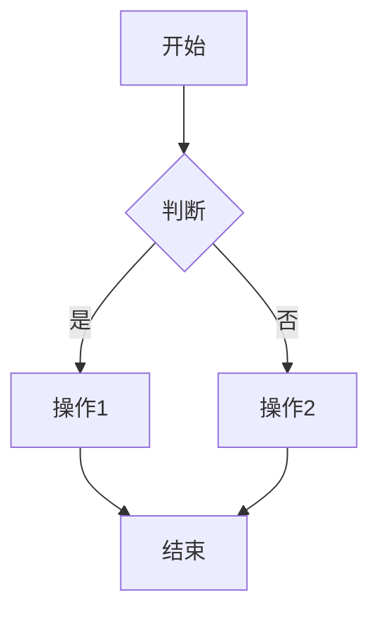

# Markdown 网站框架

一个原生 JavaScript 框架，用于构建支持动态 Markdown 内容渲染的响应式静态网站。具备 KaTeX 数学公式支持、Mermaid 图表可视化、智能缓存和模块化架构等特性。

## 特性

🚀 **框架核心特性**
- **原生 JavaScript**：无框架依赖，纯 ES6+ 实现
- **响应式设计**：移动端优先，兼顾桌面端优化
- **动态内容**：实时 Markdown 渲染，支持内容实时更新
- **模块化架构**：关注点清晰分离，组件可复用

📝 **内容渲染能力**
- **Markdown 支持**：基于 marked.js 实现完整的 CommonMark 规范支持
- **数学公式**：集成 KaTeX 实现 LaTeX 公式渲染
- **图表可视化**：支持 Mermaid.js 绘制流程图、时序图等多种图表
- **智能缓存**：智能内容缓存机制，提升加载性能

🎨 **用户体验优化**
- **渐进式加载**：流畅的加载动画和进度指示器
- **导航系统**：多级菜单，支持标题自动解析
- **移动端适配**：触控友好的界面，搭配滑出式菜单
- **主题支持**：可自定义配色方案和样式

## 快速开始

### 前置条件
- 支持 ES6+ 的现代网页浏览器
- 本地开发用 Web 服务器（因 file:// 协议存在 CORS 限制）

### 安装步骤
1. 克隆或下载本仓库
2. 使用本地 Web 服务器运行文件：
   ```bash
   # 使用 Python 3
   python -m http.server 8000
   
   # 使用 Node.js（需已安装 http-server）
   npx http-server -p 8000
   ```
3. 在浏览器中打开 `http://localhost:8000`

### 项目结构
```
tutorial/
├── index.html              # 主入口文件
├── styles.css              # 核心样式与响应式设计
├── js/                     # JavaScript 模块目录
│   ├── core.js            # 配置与状态管理
│   ├── cache.js           # 本地存储缓存系统
│   ├── menu.js            # 导航菜单处理逻辑
│   ├── content.js         # 内容渲染与加载
│   ├── utils.js           # 工具函数
│   └── main.js            # 应用入口文件
├── libs/                   # 第三方库目录
│   ├── marked.min.js      # Markdown 解析器
│   ├── katex.min.js       # 数学公式渲染器
│   ├── katex.min.css      # KaTeX 样式文件
│   ├── auto-render.min.js # KaTeX 自动渲染插件
│   └── mermaid.min.js     # 图表渲染器
├── content/                # Markdown 内容目录
│   ├── llm/               # 示例：大语言模型（LLM）相关内容
│   └── ai-programming/    # 示例：AI 编程相关内容
├── menu-config.json        # 导航配置文件
└── NOTICE.md              # 第三方库版权声明
```

## 配置说明

### 菜单配置
编辑 `menu-config.json` 自定义导航结构：

```json
{
  "menuConfig": {
    "llm": {
      "title": "大语言模型原理",
      "order": 1
    },
    "ai-programming": {
      "title": "AI 编程", 
      "order": 2
    }
  },
  "fileTitleMap": {
    "intro.md": "大语言模型概述",
    "prompt.md": "提示词工程"
  },
  "fileOrder": {
    "llm": ["intro.md", "text-representation.md", "attention-mechanism.md"],
    "ai-programming": ["prompt.md"]
  }
}
```

### 添加新内容
1. 在对应内容子目录中创建 Markdown 文件
2. 更新 `menu-config.json`，添加新文件的映射关系和排序规则
3. 系统会自动解析标题并更新导航

## 内容功能说明

### Markdown 支持
支持所有标准 Markdown 特性：
- 标题（`#`、`##`、`###`）
- 列表（有序列表和无序列表）
- 带语法高亮的代码块
- 表格、块引用、水平线
- 链接与图片

### 数学公式
使用 KaTeX 语法编写数学表达式：

**行内公式**：`$E = mc^2$` 渲染效果为 $E = mc^2$

**块级公式**：
```latex
$$
\int_{-\infty}^{\infty} e^{-x^2} dx = \sqrt{\pi}
$$
```

### 图表绘制
使用 Mermaid 语法创建图表：

````markdown

````

## 浏览器兼容性

- Chrome 60+
- Firefox 55+
- Safari 12+
- Edge 79+

## 第三方依赖

本项目使用以下开源库：
- [marked.js](https://github.com/markedjs/marked) - MIT 许可证
- [KaTeX](https://github.com/KaTeX/KaTeX) - MIT 许可证  
- [Mermaid](https://github.com/mermaid-js/mermaid) - MIT 许可证

详细版权信息请查看 [NOTICE.md](NOTICE.md)。

## 许可证

本项目基于 MIT 许可证开源 - 详见 LICENSE 文件。

## 贡献指南

欢迎贡献代码！如有 bug 反馈、功能需求或代码提交，可提交 Issue 或 Pull Request。

## 示例实现

本框架包含以 AI 原理和编程概念为主题的示例内容，展示了系统在技术文档和教育类内容场景下的应用能力。

进入 'tutorial' 目录，查看 README.md 了解更多细节。
