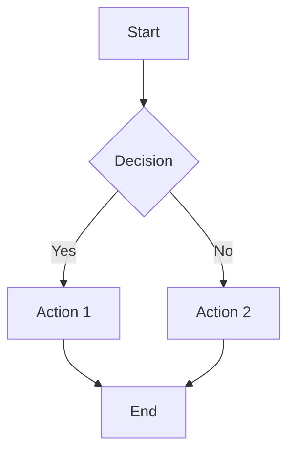

# Markdown Website Framework

A vanilla JavaScript framework for building responsive static websites with dynamic Markdown content rendering. Features include KaTeX mathematical formula support, Mermaid diagram visualization, intelligent caching, and modular architecture.

## Features

🚀 **Framework Features**
- **Vanilla JavaScript**: No framework dependencies, pure ES6+ implementation
- **Responsive Design**: Mobile-first approach with desktop optimization
- **Dynamic Content**: Real-time Markdown rendering with live updates
- **Modular Architecture**: Clean separation of concerns with reusable components

📝 **Content Rendering**
- **Markdown Support**: Full CommonMark specification support via marked.js
- **Mathematical Formulas**: LaTeX rendering with KaTeX integration
- **Diagram Visualization**: Mermaid.js support for flowcharts, sequence diagrams, and more
- **Smart Caching**: Intelligent content caching to improve performance

🎨 **User Experience**
- **Progressive Loading**: Smooth loading animations and progress indicators
- **Navigation System**: Multi-level menu with automatic title parsing
- **Mobile Optimized**: Touch-friendly interface with slide-out menus
- **Theme Support**: Customizable color schemes and styling

## Quick Start

### Prerequisites
- Modern web browser with ES6+ support
- Web server for local development (due to CORS restrictions with file:// protocol)

### Installation
1. Clone or download this repository
2. Serve the files using a local web server:
   ```bash
   # Using Python 3
   python -m http.server 8000
   
   # Using Node.js (if you have http-server installed)
   npx http-server -p 8000
   ```
3. Open `http://localhost:8000` in your browser

### Project Structure
```
tutorial/
├── index.html              # Main entry point
├── styles.css              # Core styling and responsive design
├── js/                     # JavaScript modules
│   ├── core.js            # Configuration and state management
│   ├── cache.js           # Local storage caching system
│   ├── menu.js            # Navigation menu handling
│   ├── content.js         # Content rendering and loading
│   ├── utils.js           # Utility functions
│   └── main.js            # Application entry point
├── libs/                   # Third-party libraries
│   ├── marked.min.js      # Markdown parser
│   ├── katex.min.js       # Math formula renderer
│   ├── katex.min.css      # KaTeX styles
│   ├── auto-render.min.js # KaTeX auto-renderer
│   └── mermaid.min.js     # Diagram renderer
├── content/                # Markdown content directory
│   ├── llm/               # Example: LLM principles content
│   └── ai-programming/    # Example: AI programming content
├── menu-config.json        # Navigation configuration
└── NOTICE.md              # Third-party library attributions
```

## Configuration

### Menu Configuration
Edit `menu-config.json` to customize the navigation structure:

```json
{
  "menuConfig": {
    "llm": {
      "title": "LLM Principles",
      "order": 1
    },
    "ai-programming": {
      "title": "AI Programming", 
      "order": 2
    }
  },
  "fileTitleMap": {
    "intro.md": "LLM Overview",
    "prompt.md": "Prompt Engineering"
  },
  "fileOrder": {
    "llm": ["intro.md", "text-representation.md", "attention-mechanism.md"],
    "ai-programming": ["prompt.md"]
  }
}
```

### Adding New Content
1. Create Markdown files in the appropriate content subdirectory
2. Update `menu-config.json` with new file mappings and ordering
3. The system will automatically parse headings for navigation

## Content Features

### Markdown Support
All standard Markdown features are supported:
- Headers (`#`, `##`, `###`)
- Lists (ordered and unordered)
- Code blocks with syntax highlighting
- Tables, blockquotes, and horizontal rules
- Links and images

### Mathematical Formulas
Use KaTeX syntax for mathematical expressions:

**Inline formulas**: `$E = mc^2$` renders as $E = mc^2$

**Block formulas**:
```latex
$$
\int_{-\infty}^{\infty} e^{-x^2} dx = \sqrt{\pi}
$$
```

### Diagrams and Charts
Create diagrams using Mermaid syntax:

````markdown

````

## Browser Compatibility

- Chrome 60+
- Firefox 55+
- Safari 12+
- Edge 79+

## Third-Party Dependencies

This project uses the following open source libraries:
- [marked.js](https://github.com/markedjs/marked) - MIT License
- [KaTeX](https://github.com/KaTeX/KaTeX) - MIT License  
- [Mermaid](https://github.com/mermaid-js/mermaid) - MIT License

For detailed attribution information, see [NOTICE.md](NOTICE.md).

## License

This project is licensed under the MIT License - see the LICENSE file for details.

## Contributing

Contributions are welcome! Please feel free to submit pull requests or open issues for bugs and feature requests.

## Example Implementation

This framework includes example content focused on AI principles and programming concepts, demonstrating the system's capabilities for technical documentation and educational content.