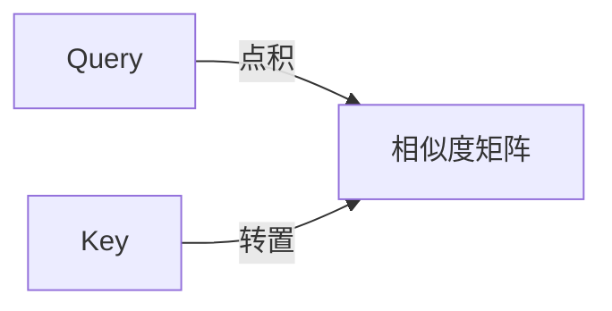
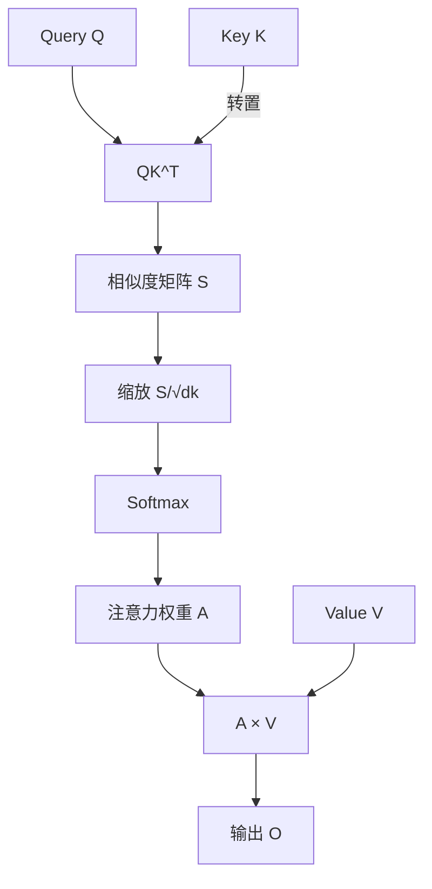
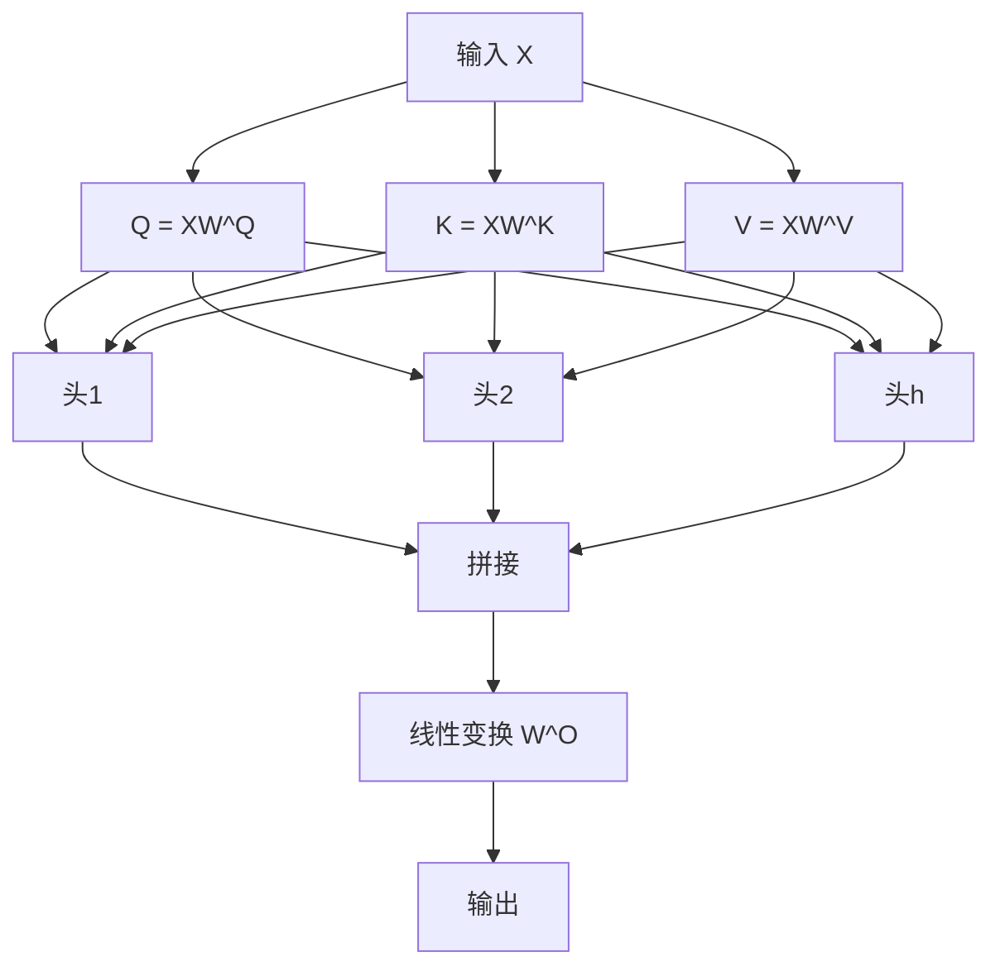

# 注意力机制的原理剖析

## 1. 注意力机制的本质

### 1.1 从人类认知到机器学习

**注意力**（Attention）是人类认知的核心能力。当我们阅读句子时，大脑会自动关注与当前理解最相关的词，而忽略无关信息。

> **例子**：在句子"The cat sat on the mat"中，理解"sat"时，我们会关注"cat"（主语）和"mat"（地点），而不是"the"（冠词）。

在机器学习中，注意力机制让模型能够**动态地分配权重**，聚焦于输入中最重要的部分。

### 1.2 注意力的数学定义

给定查询（Query）$\mathbf{Q}$、键（Key）$\mathbf{K}$和值（Value）$\mathbf{V}$，注意力机制计算：

$$\text{Attention}(\mathbf{Q}, \mathbf{K}, \mathbf{V}) = \sum_{i} \alpha_i \mathbf{V}_i$$

其中权重 $\alpha_i$ 通过查询和键的相似度计算：

$$\alpha_i = \frac{\exp(\text{sim}(\mathbf{Q}, \mathbf{K}_i))}{\sum_j \exp(\text{sim}(\mathbf{Q}, \mathbf{K}_j))}$$

### 1.3 Q、K、V的直观理解

| 符号 | 含义 | 直观理解 |
|------|------|----------|
| **Query (Q)** | 查询 | "我在找什么？" |
| **Key (K)** | 键 | "我有什么？" |
| **Value (V)** | 值 | "我要返回什么？" |

> **类比**：想象你在图书馆找书。Query是你的需求（"关于机器学习的书"），Key是每本书的标签（书名、作者、分类），Value是书的内容。注意力机制就是根据你的Query和每本书的Key计算匹配度，然后加权汇总所有书的内容。

## 2. 缩放点积注意力（Scaled Dot-Product Attention）

### 2.1 核心公式

Transformer使用的注意力机制是**缩放点积注意力**：

$$\text{Attention}(\mathbf{Q}, \mathbf{K}, \mathbf{V}) = \text{softmax}\left(\frac{\mathbf{Q}\mathbf{K}^T}{\sqrt{d_k}}\right)\mathbf{V}$$

其中：
- $\mathbf{Q} \in \mathbb{R}^{n \times d_k}$：查询矩阵
- $\mathbf{K} \in \mathbb{R}^{m \times d_k}$：键矩阵
- $\mathbf{V} \in \mathbb{R}^{m \times d_v}$：值矩阵
- $d_k$：键的维度
- $n$：查询数量
- $m$：键值对数量

### 2.2 公式拆解

#### 2.2.1 步骤1：计算相似度矩阵

$$\mathbf{S} = \mathbf{Q}\mathbf{K}^T$$

$\mathbf{S}_{ij} = \mathbf{Q}_i \cdot \mathbf{K}_j$ 表示第 $i$ 个查询与第 $j$ 个键的相似度。



#### 2.2.2 步骤2：缩放

$$\mathbf{S}' = \frac{\mathbf{S}}{\sqrt{d_k}}$$

**为什么需要缩放？**

当 $d_k$ 很大时，点积的结果会变得很大，导致softmax进入饱和区域（梯度接近0）。缩放使得点积的方差保持在合理范围内。

**数学推导**：

假设 $\mathbf{Q}$ 和 $\mathbf{K}$ 的每个分量是均值为0、方差为1的独立随机变量：

$$\text{Var}(\mathbf{Q}_i \cdot \mathbf{K}_j) = \sum_{k=1}^{d_k} \text{Var}(Q_{ik} K_{jk}) = d_k$$

除以 $\sqrt{d_k}$ 后，方差变为1。

#### 2.2.3 步骤3：Softmax归一化

$$\mathbf{A} = \text{softmax}(\mathbf{S}')$$

$$A_{ij} = \frac{\exp(S'_{ij})}{\sum_{k=1}^{m} \exp(S'_{ik})}$$

Softmax确保每行的和为1，得到注意力权重矩阵。

#### 2.2.4 步骤4：加权求和

$$\mathbf{O} = \mathbf{A}\mathbf{V}$$

$$\mathbf{O}_i = \sum_{j=1}^{m} A_{ij} \mathbf{V}_j$$

输出是值的加权和，权重由注意力权重矩阵决定。

### 2.3 完整流程可视化



### 2.4 复杂度分析

| 操作 | 计算复杂度 | 说明 |
|------|-----------|------|
| $\mathbf{Q}\mathbf{K}^T$ | $O(n \cdot m \cdot d_k)$ | 点积计算 |
| Softmax | $O(n \cdot m)$ | 归一化 |
| $\mathbf{A}\mathbf{V}$ | $O(n \cdot m \cdot d_v)$ | 加权求和 |
| **总计** | $O(n \cdot m \cdot d_k + n \cdot m \cdot d_v)$ | |

对于自注意力（$n = m = L$），复杂度为 $O(L^2 \cdot d)$，其中 $L$ 是序列长度。

## 3. 多头注意力（Multi-Head Attention）

### 3.1 为什么需要多头注意力？

单一注意力头只能学习一种关注模式。多头注意力允许模型**同时关注不同位置和不同表示子空间**的信息。

> **类比**：就像人有多种感官（视觉、听觉、触觉），多头注意力让模型从多个"视角"理解输入。

### 3.2 多头注意力的数学定义

给定 $h$ 个注意力头，每个头有独立的参数：

$$\text{head}_i = \text{Attention}(\mathbf{Q}\mathbf{W}_i^Q, \mathbf{K}\mathbf{W}_i^K, \mathbf{V}\mathbf{W}_i^V)$$

其中：
- $\mathbf{W}_i^Q \in \mathbb{R}^{d_{\text{model}} \times d_k}$
- $\mathbf{W}_i^K \in \mathbb{R}^{d_{\text{model}} \times d_k}$
- $\mathbf{W}_i^V \in \mathbb{R}^{d_{\text{model}} \times d_v}$

所有头的输出拼接后通过线性变换：

$$\text{MultiHead}(\mathbf{Q}, \mathbf{K}, \mathbf{V}) = \text{Concat}(\text{head}_1, \ldots, \text{head}_h)\mathbf{W}^O$$

其中 $\mathbf{W}^O \in \mathbb{R}^{h \cdot d_v \times d_{\text{model}}}$。

### 3.3 多头注意力的结构



### 3.4 头的维度设置

通常设置 $d_k = d_v = d_{\text{model}} / h$，这样每个头的计算量大致相同。

| 模型 | $d_{\text{model}}$ | $h$ | $d_k = d_v$ |
|------|------------------|----|------------|
| Transformer (base) | 512 | 8 | 64 |
| Transformer (big) | 1024 | 16 | 64 |
| GPT-3 (175B) | 12288 | 96 | 128 |

### 3.5 多头注意力的优势

1. **多样性**：不同头学习不同的关注模式
2. **并行性**：所有头可以并行计算
3. **表达能力**：组合多个头的输出增强表达能力
4. **可解释性**：可以单独分析每个头的关注模式

## 4. 注意力模式的可视化分析

### 4.1 常见的注意力模式

#### 4.1.1 局部注意力

模型主要关注相邻的词：

```
The cat sat on the mat
  ↑   ↑   ↑   ↑   ↑   ↑
  └───┴───┴───┴───┴───┘
      局部关注
```

#### 4.1.2 全局注意力

模型关注整个序列中的关键信息：

```
The cat sat on the mat
  ↑               ↑
  └───────────────┘
      长距离依赖
```

#### 4.1.3 语法结构注意力

模型学习到语法结构关系：

```
The cat that chased the mouse ran away
  ↑   ↑       ↑       ↑    ↑   ↑   ↑
  └───┴───────┴───────┴────┴───┴───┘
      主语从句结构
```

### 4.2 注意力热力图示例

假设句子："The cat sat on the mat"

| | The | cat | sat | on | the | mat |
|---|-----|-----|-----|----|-----|-----|
| The | 0.8 | 0.1 | 0.05 | 0.02 | 0.02 | 0.01 |
| cat | 0.1 | 0.7 | 0.15 | 0.03 | 0.01 | 0.01 |
| sat | 0.05 | 0.2 | 0.5 | 0.15 | 0.05 | 0.05 |
| on | 0.02 | 0.05 | 0.1 | 0.6 | 0.15 | 0.08 |
| the | 0.02 | 0.03 | 0.05 | 0.1 | 0.7 | 0.1 |
| mat | 0.01 | 0.02 | 0.05 | 0.1 | 0.15 | 0.67 |

表格中数值越大表示注意力权重越高。

## 5. 注意力机制的变体

### 5.1 自注意力（Self-Attention）

在自注意力中，Q、K、V都来自同一个输入：

$$\mathbf{Q} = \mathbf{K} = \mathbf{V} = \mathbf{X}\mathbf{W}$$

自注意力让序列中的每个位置都能"看到"其他所有位置的信息。

### 5.2 交叉注意力（Cross-Attention）

交叉注意力用于两个不同序列之间的交互：

$$\mathbf{Q} = \mathbf{X}^{\text{query}}\mathbf{W}^Q$$
$$\mathbf{K} = \mathbf{X}^{\text{key}}\mathbf{W}^K$$
$$\mathbf{V} = \mathbf{X}^{\text{value}}\mathbf{W}^V$$

**应用场景**：
- 机器翻译：源语言和目标语言之间的对齐
- 图文匹配：图像和文本之间的交互
- 问答：问题和文档之间的关联

### 5.3 稀疏注意力（Sparse Attention）

为了降低计算复杂度，稀疏注意力只计算部分位置的注意力：

| 类型 | 复杂度 | 特点 |
|------|--------|------|
| **局部注意力** | $O(L \cdot w)$ | 只关注固定窗口 $w$ 内的位置 |
| **块注意力** | $O(L \cdot \sqrt{L})$ | 分块计算，块内全连接 |
| **随机注意力** | $O(L \cdot k)$ | 随机选择 $k$ 个位置 |
| **固定模式注意力** | $O(L \cdot \log L)$ | 使用固定的注意力模式 |

**代表模型**：Longformer, BigBird, Reformer

### 5.4 线性注意力（Linear Attention）

通过核技巧将二次复杂度降为线性：

$$\text{Attention}(\mathbf{Q}, \mathbf{K}, \mathbf{V}) = \phi(\mathbf{Q})(\phi(\mathbf{K})^T\mathbf{V})$$

其中 $\phi(\cdot)$ 是特征映射函数。

**代表模型**：Linear Transformer, Performer

### 5.5 Flash Attention

Flash Attention通过**IO感知**的精确注意力算法，大幅提升计算效率：

- **分块计算**：将注意力矩阵分块，避免存储完整的 $L \times L$ 矩阵
- **重计算**：在反向传播时重计算而非存储中间结果
- **融合内核**：将多个操作融合到单个GPU内核中

**效果**：在保持精度的同时，速度提升2-4倍，内存使用减少5-10倍。

## 6. 注意力机制的理论分析

### 6.1 注意力与图神经网络

注意力机制可以看作是一种**图神经网络**：

- 序列中的每个token是图的一个节点
- 注意力权重定义节点之间的边
- 注意力计算类似于消息传递

$$\mathbf{h}_i^{(l+1)} = \sum_{j} \alpha_{ij} \mathbf{h}_j^{(l)}$$

### 6.2 注意力与核方法

注意力机制与**核方法**有深刻联系：

$$\text{Attention}(\mathbf{Q}, \mathbf{K}, \mathbf{V}) = \sum_{j} \frac{K(\mathbf{Q}_i, \mathbf{K}_j)}{\sum_k K(\mathbf{Q}_i, \mathbf{K}_k)} \mathbf{V}_j$$

其中 $K(\cdot, \cdot)$ 是核函数（如RBF核）。

### 6.3 注意力的表达能力

研究表明，注意力机制具有强大的表达能力：

1. **通用近似器**：多头注意力可以近似任何连续函数
2. **图灵完备**：Transformer可以模拟图灵机
3. **归纳偏置**：注意力机制天然适合处理序列数据

## 7. 注意力机制的实践技巧

### 7.1 注意力掩码（Attention Mask）

注意力掩码用于控制哪些位置可以相互关注：

| 掩码类型 | 用途 | 示例 |
|---------|------|------|
| **因果掩码** | 自回归生成 | 当前词只能看到之前的词 |
| **填充掩码** | 批处理 | 忽略填充位置 |
| **语言掩码** | 掩码语言建模 | 随机掩盖部分token |

**因果掩码的数学表示**：

$$M_{ij} = \begin{cases}
0 & \text{if } i \geq j \\
-\infty & \text{if } i < j
\end{cases}$$

$$\text{Attention}_{\text{causal}} = \text{softmax}\left(\frac{\mathbf{Q}\mathbf{K}^T}{\sqrt{d_k}} + \mathbf{M}\right)\mathbf{V}$$

### 7.2 注意力dropout

在注意力权重上应用dropout，防止过拟合：

$$\mathbf{A}' = \text{dropout}(\mathbf{A})$$

$$\mathbf{O} = \mathbf{A}'\mathbf{V}$$

### 7.3 注意力温度

在推理时，可以通过调整温度来控制注意力的"锐度"：

$$\mathbf{A} = \text{softmax}\left(\frac{\mathbf{Q}\mathbf{K}^T}{T \cdot \sqrt{d_k}}\right)$$

- $T < 1$：更尖锐，关注更集中
- $T > 1$：更平滑，关注更分散

## 8. 注意力机制的可解释性

### 8.1 注意力作为解释

注意力权重常被用作模型决策的解释：

> **例子**：在情感分析中，如果模型对"terrible"这个词的注意力权重很高，可以解释为模型因为这个词而判断为负面情感。

### 8.2 注意力的局限性

然而，注意力权重并不总是可靠的解释：

1. **相关性≠因果性**：高注意力不一定表示因果关系
2. **分布外数据**：在训练数据外的模式上，注意力可能不可靠
3. **多头复杂性**：多个头的组合难以解释

### 8.3 更好的解释方法

替代或补充注意力解释的方法：
- **梯度归因**（Gradient Attribution）
- **干预分析**（Intervention Analysis）
- **探针任务**（Probing Tasks）

## 9. 小结

注意力机制是现代大语言模型的核心创新，它让模型能够动态地聚焦于输入中最重要的部分。

关键要点：
1. 注意力机制通过Q、K、V三元组计算加权求和
2. 缩放点积注意力是Transformer的标准注意力机制
3. 多头注意力允许模型从多个视角理解输入
4. 注意力机制有多种变体，各有优劣
5. 注意力机制具有强大的理论表达能力
6. 注意力权重可以作为模型决策的解释，但有局限性
7. 实践中需要注意掩码、dropout等技巧

下一章，我们将深入剖析Transformer架构，看看注意力机制如何与其他组件协同工作，构建出强大的语言模型。
