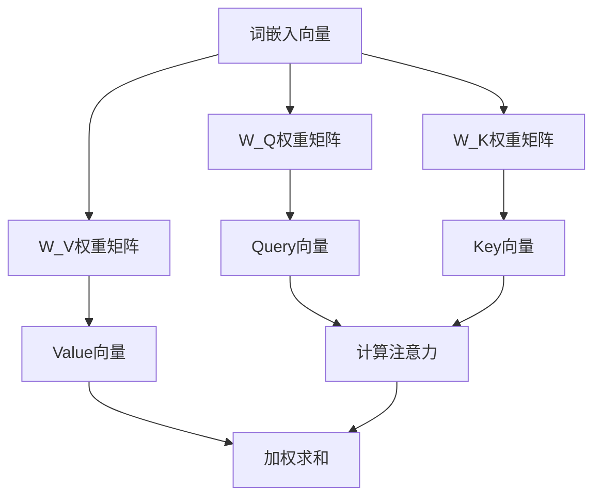
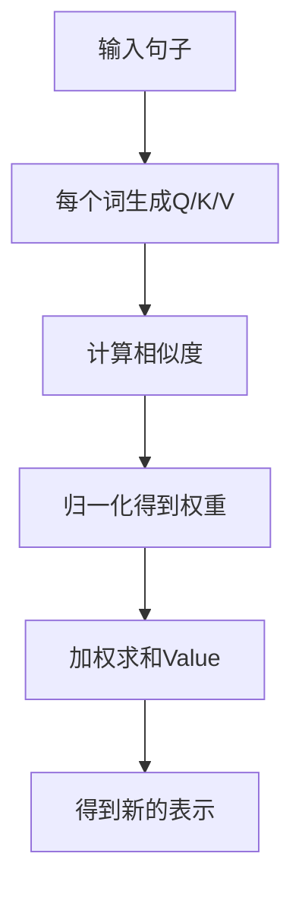

# 注意力机制的原理剖析

## 什么是注意力机制？

注意力（Attention）是人类认知的核心能力。当你阅读句子时，你的大脑会自动关注与当前理解最相关的词，而忽略无关信息。

> **例子**：在句子"今天天气真好，我想出去玩"中，理解"玩"时，你会关注"今天"、"天气"、"真好"、"想"，而不是"我"、"出去"。

在机器学习中，注意力机制让模型能够**动态地分配权重**，聚焦于输入中最重要的部分。

## 注意力机制的核心思想

### Q、K、V：注意力机制的三要素

注意力机制使用三个概念：Query（查询）、Key（键）、Value（值）。这三个概念来自数据库领域，我们可以用生活中的例子来理解。

> **直观理解**：想象你在图书馆找书。
> - **Query（查询）**：你的需求，比如"关于机器学习的书"
> - **Key（键）**：每本书的标签，比如书名、作者、分类
> - **Value（值）**：书的内容

注意力机制就是根据你的Query和每本书的Key计算匹配度，然后加权汇总所有书的内容。

### 在语言模型中的应用

在语言模型中，Q、K、V都来自输入的词向量：

```
对于句子："今天天气真好，我想出去玩"

每个词都会生成三个向量：
- Query向量：这个词在"问"什么
- Key向量：这个词"提供"了什么信息
- Value向量：这个词的"实际内容"
```

## Q、K、V向量是如何生成的？

### 从词嵌入到Q、K、V

现在我们来详细解释：词嵌入向量是如何转换成Q、K、V三个向量的？

> **直观理解**：想象你有一张照片（词嵌入向量），你想从三个不同的角度来观察它。你可以用三面不同的镜子，每面镜子都展示照片的一个侧面。这三面镜子就是三个权重矩阵，它们把原始照片"投影"到三个不同的视角。

### 权重矩阵：三个"投影器"

对于每个词的嵌入向量，我们使用三个权重矩阵来生成Q、K、V：

```
Q = 词嵌入 × W_Q
K = 词嵌入 × W_K
V = 词嵌入 × W_V
```

其中：
- W_Q、W_K、W_V 是三个可学习的权重矩阵
- × 表示矩阵乘法

> **数学概念：矩阵乘法**：矩阵乘法是一种线性变换。就像你把一个物体旋转、缩放、倾斜，但本质上还是同一个物体，只是从不同角度看。权重矩阵定义了这种变换的具体方式。

### 什么是"投影"？

从线性代数角度看，将向量乘以权重矩阵，就是将向量"投影"到另一个向量空间。

> **直观理解**：想象你在三维空间中有一个向量，你把它投影到二维平面上。投影后的向量保留了原始向量在某个方向上的信息，但丢失了其他方向的信息。

在注意力机制中：
- W_Q 将词嵌入投影到"查询空间"
- W_K 将词嵌入投影到"键空间"
- W_V 将词嵌入投影到"值空间"

这三个空间有不同的"语义"：
- 查询空间：关注"我想知道什么"
- 键空间：关注"我能提供什么"
- 值空间：关注"我的实际内容是什么"

### 具体例子

假设词嵌入的维度是 512，Q、K、V 的维度也是 512（在单头注意力中）。

```
词嵌入向量：[e1, e2, e3, ..., e512]  （512维）

权重矩阵 W_Q：512 × 512
权重矩阵 W_K：512 × 512
权重矩阵 W_V：512 × 512

Q向量 = 词嵌入 × W_Q = [q1, q2, q3, ..., q512]
K向量 = 词嵌入 × W_K = [k1, k2, k3, ..., k512]
V向量 = 词嵌入 × W_V = [v1, v2, v3, ..., v512]
```

> **数学概念：维度**：向量的维度可以理解为它包含的信息量。512维意味着向量有512个分量，每个分量都携带一部分信息。

### 为什么需要三个不同的向量？

你可能会问：为什么不直接用词嵌入，而要生成三个不同的向量？

> **直观理解**：想象你在面试中：
> - 你有一个"自我介绍"（词嵌入）
> - 但面试官可能从不同角度提问：
>   - "你的优势是什么？" → 你需要从"优势角度"回答（Q）
>   - "你的技能有哪些？" → 你需要从"技能角度"回答（K）
>   - "你的经历如何？" → 你需要从"经历角度"回答（V）

虽然信息都来自你的"自我介绍"，但不同的角度会突出不同的信息。

在注意力机制中：
- Q向量：用于"查询"其他词，突出"我想知道什么"
- K向量：用于被"查询"，突出"我能提供什么"
- V向量：用于"贡献"最终结果，突出"我的实际内容"

### 权重矩阵是如何学习的？

权重矩阵 W_Q、W_K、W_V 不是人工设计的，而是通过训练自动学习的。

> **直观理解**：就像小孩子学习语言，没有人告诉他"应该关注什么"，但他通过大量的阅读和对话，自然而然地学会了如何关注重要信息。

训练过程中，模型会不断调整这些权重矩阵，使得注意力机制能够更好地完成语言建模任务。

### 多头注意力中的Q、K、V

在多头注意力中，每个头都有自己的权重矩阵。假设有8个头：

```
头1：W_Q^1, W_K^1, W_V^1
头2：W_Q^2, W_K^2, W_V^2
...
头8：W_Q^8, W_K^8, W_V^8
```

每个头将词嵌入投影到不同的子空间，学习不同的关注模式。

> **直观理解**：就像你有8个不同的专家，每个专家都有自己的专长。一个专家可能擅长语法，另一个可能擅长情感，第三个可能擅长时间关系。每个专家都有自己的"视角"（子空间）。

### 流程图



### 小结

Q、K、V向量的生成过程：

1. **输入**：词嵌入向量
2. **变换**：通过三个权重矩阵 W_Q、W_K、W_V 进行线性变换
3. **输出**：Q、K、V三个向量

从线性代数角度，这个过程就是将词嵌入向量"投影"到三个不同的子空间，每个子空间都有不同的语义含义。

> **数学概念回顾**：
> - **矩阵乘法**：线性变换，将向量从一个空间映射到另一个空间
> - **投影**：将向量映射到子空间，保留某些方向的信息
> - **子空间**：向量空间的一部分，就像一个"视角"或"角度"

现在我们理解了Q、K、V向量是如何生成的。接下来，让我们看看这些向量是如何在注意力计算中发挥作用的。

## 注意力是如何工作的？

让我们用"今天天气真好，我想出去玩"这个例子来说明。

### 第一步：计算相似度

假设我们要理解"玩"这个词，我们需要知道它和其他词的关系。

> **直观理解**：就像你在聚会上认识新朋友，你会观察每个人，判断谁和你更"合得来"。这个"合得来"的程度就是相似度。

在注意力机制中，我们计算"玩"的Query向量和其他词的Key向量的相似度：

```
"玩"的Query vs "今天"的Key → 相似度：0.1
"玩"的Query vs "天气"的Key → 相似度：0.2
"玩"的Query vs "真"的Key → 相似度：0.3
"玩"的Query vs "好"的Key → 相似度：0.4
"玩"的Query vs "，"的Key → 相似度：0.0
"玩"的Query vs "我"的Key → 相似度：0.1
"玩"的Query vs "想"的Key → 相似度：0.5
"玩"的Query vs "出"的Key → 相似度：0.6
"玩"的Query vs "去"的Key → 相似度：0.7
"玩"的Query vs "玩"的Key → 相似度：0.8
```

注意：这些数字是假设的，实际值由模型学习得到。

> **数学概念：点积**：相似度通常用点积来计算。点积可以理解为两个向量的"对齐程度"。如果两个向量方向一致，点积就大；如果方向相反，点积就小。这就像两个人"志同道合"。

### 第二步：归一化（Softmax）

相似度需要转换成权重，所有权重加起来等于1。这通过Softmax函数实现。

> **直观理解**：就像你有一笔钱要分配给不同的人，你根据和每个人的关系决定给多少钱。关系越好，给的钱越多。最后，所有人的钱加起来等于你的总金额。

```
原始相似度：[0.1, 0.2, 0.3, 0.4, 0.0, 0.1, 0.5, 0.6, 0.7, 0.8]
归一化后：[0.03, 0.05, 0.07, 0.09, 0.00, 0.03, 0.12, 0.14, 0.16, 0.18]
```

这些就是注意力权重！

### 第三步：加权求和

现在，我们用这些权重对每个词的Value向量进行加权求和：

```
"玩"的最终表示 =
  0.03 × "今天"的Value +
  0.05 × "天气"的Value +
  0.07 × "真"的Value +
  0.09 × "好"的Value +
  0.00 × "，"的Value +
  0.03 × "我"的Value +
  0.12 × "想"的Value +
  0.14 × "出"的Value +
  0.16 × "去"的Value +
  0.18 × "玩"的Value
```

> **直观理解**：就像你在做决定时，会听取不同人的意见，但给每个人的意见不同的权重。关系好的人，你更重视他的意见。

### 完整流程图



## 多头注意力：从多个角度看问题

### 为什么需要多头注意力？

单一注意力头只能学习一种关注模式。多头注意力允许模型**同时关注不同位置和不同表示子空间**的信息。

> **直观理解**：就像人有多种感官（视觉、听觉、触觉），多头注意力让模型从多个"视角"理解输入。比如理解"今天天气真好"，一个头可能关注"今天"（时间），另一个头可能关注"天气"（主题），第三个头可能关注"真好"（情感）。

### 多头注意力如何工作？

假设我们有4个注意力头，每个头会学习不同的关注模式：

```
头1：关注语法关系（主谓宾）
头2：关注语义关系（同义词、反义词）
头3：关注情感倾向（正面、负面）
头4：关注时间关系（过去、现在、未来）
```

对于"玩"这个词：
- 头1可能关注"我"（主语）
- 头2可能关注"出去"（近义词）
- 头3可能关注"真好"（正面情感）
- 头4可能关注"今天"（时间）

每个头独立计算注意力，然后把结果拼接起来。

> **数学概念：投影**：每个头可以看作是把向量投影到不同的"子空间"。就像你从不同角度看一个物体，每个角度看到的都不一样，但都是这个物体的真实面貌。多头注意力就是让模型从多个"角度"理解语言。

### 多头注意力的优势

1. **多样性**：不同头学习不同的关注模式
2. **并行性**：所有头可以并行计算
3. **表达能力**：组合多个头的输出增强表达能力
4. **可解释性**：可以单独分析每个头的关注模式

## 自注意力 vs 交叉注意力

### 自注意力（Self-Attention）

在自注意力中，Q、K、V都来自同一个输入序列。

> **直观理解**：就像你在阅读一篇文章时，理解每个词都需要参考文章中的其他词。理解"玩"，需要参考"今天"、"天气"、"想"等。

自注意力让序列中的每个位置都能"看到"其他所有位置的信息。

### 交叉注意力（Cross-Attention）

交叉注意力用于两个不同序列之间的交互。

> **直观理解**：就像你在做翻译，理解英文句子时需要参考中文原文。Q来自目标语言，K和V来自源语言。

**应用场景**：
- 机器翻译：源语言和目标语言之间的对齐
- 图文匹配：图像和文本之间的交互
- 问答：问题和文档之间的关联

## 注意力掩码：控制谁能看到谁

### 因果掩码（Causal Mask）

在生成任务中，模型不能"偷看"未来。因果掩码确保当前位置只能看到之前的位置。

> **直观理解**：就像你在考试，只能看到已经做过的题目，不能看后面的题目。如果让你预测下一个词，你不能知道答案是什么。

对于"今天天气真好，我想出去玩"：
- 理解"今天"时，只能看到"今天"
- 理解"天气"时，只能看到"今天"、"天气"
- 理解"玩"时，只能看到"今天"、"天气"、"真"、"好"、"，"、"我"、"想"、"出"、"去"

### 填充掩码（Padding Mask）

在批处理时，不同长度的句子需要填充到相同长度。填充掩码告诉模型忽略填充位置。

> **直观理解**：就像你在填表格，有些格子是空的，你不需要关心这些空格子。

## 注意力机制的可视化

### 注意力热力图

注意力权重可以用热力图来可视化，颜色越深表示权重越大。

对于"今天天气真好，我想出去玩"，理解"玩"时的注意力权重可能长这样：

| | 今天 | 天气 | 真 | 好 | ， | 我 | 想 | 出 | 去 | 玩 |
|---|-----|-----|----|----|----|----|----|----|----|----|
| 玩 | 0.03 | 0.05 | 0.07 | 0.09 | 0.00 | 0.03 | 0.12 | 0.14 | 0.16 | 0.18 |

从表中可以看出，"玩"最关注"去"、"出"、"想"，这符合我们的直觉。

### 注意力模式

训练好的模型会展现出不同的注意力模式：

1. **局部注意力**：主要关注相邻的词
   - 例子：理解"天气"时，主要关注"今天"、"真"

2. **全局注意力**：关注整个序列中的关键信息
   - 例子：理解"玩"时，可能关注"今天"（时间）和"想"（意图）

3. **语法结构注意力**：学习到语法结构关系
   - 例子：理解"玩"时，可能关注"我"（主语）

## 注意力机制的优势

### 1. 长距离依赖

传统的RNN难以捕捉长距离依赖，而注意力机制可以直接连接任意两个位置。

> **直观理解**：就像你在读一本长篇小说，理解结尾时可能需要回忆开头的情节。注意力机制让模型能够"跳跃"到任何位置。

### 2. 并行计算

RNN需要按顺序处理，而注意力机制可以并行处理所有位置。

> **直观理解**：就像一个团队工作，RNN是串行工作（一个人做完另一个人才开始），注意力机制是并行工作（所有人同时工作）。

### 3. 可解释性

注意力权重可以告诉我们模型关注了什么。

> **直观理解**：就像你可以问一个人"你为什么这么想？"，他会告诉你他关注了哪些信息。注意力权重就是模型的"解释"。

## 小结

注意力机制是现代大语言模型的核心创新。关键要点：

1. **Q、K、V**：Query、Key、Value三个概念，来自数据库的查询机制
2. **注意力计算**：计算相似度 → 归一化 → 加权求和
3. **多头注意力**：从多个视角理解输入，增强表达能力
4. **自注意力**：序列内部的信息交互
5. **交叉注意力**：不同序列之间的信息交互
6. **注意力掩码**：控制谁能看到谁，比如因果掩码防止"偷看"未来
7. **优势**：长距离依赖、并行计算、可解释性

> **数学概念回顾**：
> - **点积**：计算向量相似度，就像判断两个人是否"志同道合"
> - **投影**：把向量投影到不同子空间，就像从不同角度看物体
> - **Softmax**：归一化，就像分配有限的资源

现在，我们理解了注意力机制如何让模型"关注"重要信息。下一章，我们将学习如何把注意力机制组织成完整的架构——Transformer。
