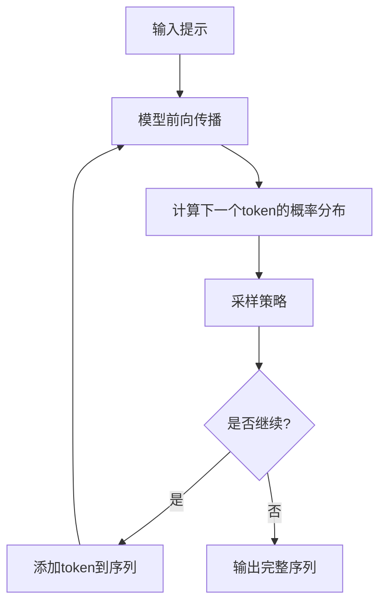
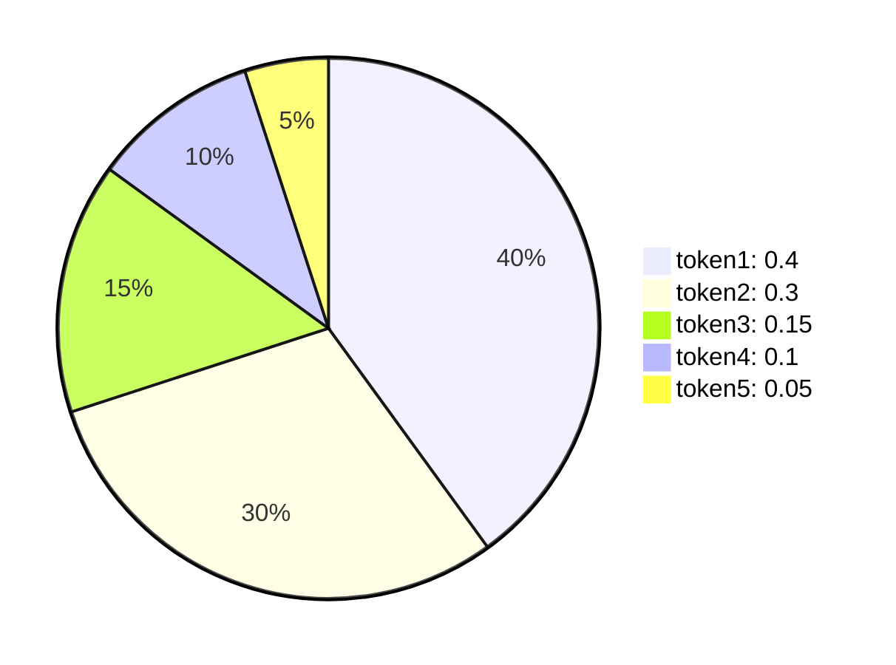
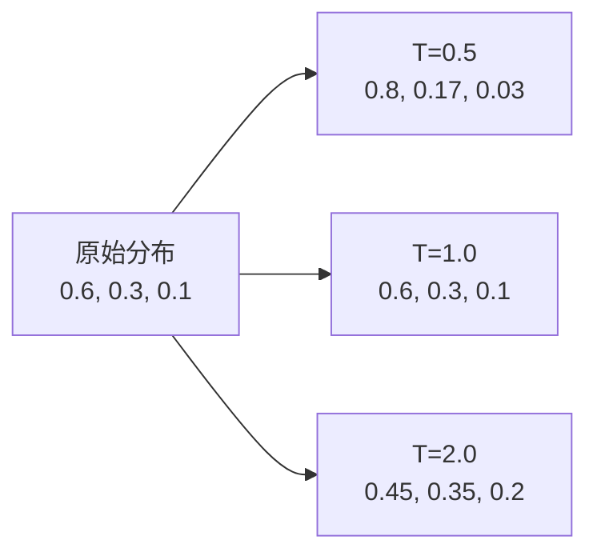
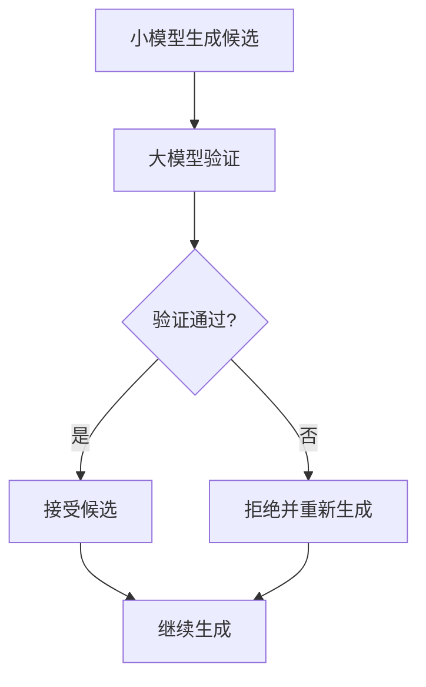
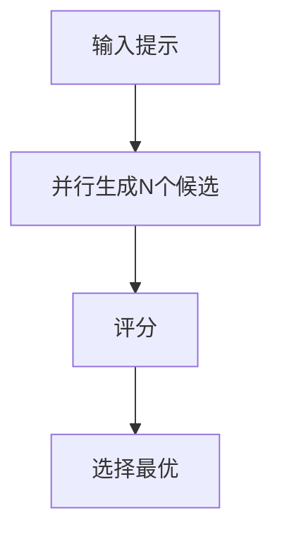

# 生成式推理的数学原理

## 1. 从训练到推理

### 1.1 推理的本质

在训练阶段，模型学习的是条件概率分布 $P(x_t | x_{<t})$。在推理阶段，我们需要从这个分布中**采样**或**选择**最可能的token序列。

> **类比**：训练就像学习写作的规律，推理就像实际写作，根据学到的规律选择下一个词。

### 1.2 推理流程概览



## 2. 基础采样策略

### 2.1 贪婪解码（Greedy Decoding）

#### 2.1.1 算法描述

贪婪解码每一步都选择概率最高的token：

$$x_t = \arg\max_{x \in \mathcal{V}} P(x | x_{<t})$$

#### 2.1.2 优缺点

| 优点 | 缺点 |
|------|------|
| 简单高效 | 可能陷入局部最优 |
| 确定性输出 | 缺乏多样性 |
| 快速推理 | 可能生成重复内容 |

> **例子**：句子"The cat sat on the ___"，贪婪解码可能选择"mat"（概率最高），但"chair"、"floor"也是合理的选择。

### 2.2 束搜索（Beam Search）

#### 2.2.1 算法描述

束搜索维护 $k$ 个最优候选序列（束宽 $k$）：

1. 初始化：从第一个token选择 $k$ 个最高概率的候选
2. 扩展：对每个候选，扩展下一个token的所有可能
3. 选择：从所有扩展后的序列中选择 $k$ 个概率最高的
4. 重复：直到生成结束符或达到最大长度

#### 2.2.2 数学表示

给定束宽 $k$，在每一步 $t$：

$$\mathcal{B}_t = \text{Top}_k\{(\mathbf{x}_{<t}, x_t) : \mathbf{x}_{<t} \in \mathcal{B}_{t-1}, x_t \in \mathcal{V}\}$$

其中 $\text{Top}_k$ 表示选择概率最高的 $k$ 个序列。

#### 2.2.3 长度归一化

为了避免偏向短序列，使用长度归一化：

$$\text{Score}(\mathbf{x}) = \frac{1}{|\mathbf{x}|^\alpha} \sum_{t=1}^{|\mathbf{x}|} \log P(x_t | x_{<t})$$

其中 $\alpha \in [0, 1]$ 是长度惩罚系数。

#### 2.2.4 优缺点

| 优点 | 缺点 |
|------|------|
| 比贪婪解码更优 | 计算复杂度高 |
| 平衡探索与利用 | 可能生成重复内容 |
| 可控的搜索空间 | 需要调整束宽 |

### 2.3 核采样（Nucleus Sampling）

#### 2.3.1 算法描述

核采样（也称Top-p采样）从累积概率达到 $p$ 的最小集合中采样：

$$\mathcal{V}_p = \{x : \sum_{x' \in \mathcal{V}_{\ge x}} P(x' | x_{<t}) \ge p\}$$

$$P'(x | x_{<t}) = \begin{cases}
\frac{P(x | x_{<t})}{\sum_{x' \in \mathcal{V}_p} P(x' | x_{<t})} & \text{if } x \in \mathcal{V}_p \\
0 & \text{otherwise}
\end{cases}$$

#### 2.3.2 可视化

假设概率分布为：[0.4, 0.3, 0.15, 0.1, 0.05]，设置 $p=0.8$：



累积概率：0.4, 0.7, 0.85, 0.95, 1.0

$\mathcal{V}_{0.8} = \{token1, token2, token3\}$（累积概率0.85 ≥ 0.8）

#### 2.3.3 优缺点

| 优点 | 缺点 |
|------|------|
| 自适应的候选集 | 需要调整p值 |
| 平衡多样性和质量 | 可能采样到低概率token |
| 适合开放域生成 | 不确定性强 |

### 2.4 Top-k采样

#### 2.4.1 算法描述

Top-k采样从概率最高的 $k$ 个token中均匀采样：

$$\mathcal{V}_k = \text{Top}_k\{P(x | x_{<t})\}$$

$$P'(x | x_{<t}) = \begin{cases}
\frac{1}{k} & \text{if } x \in \mathcal{V}_k \\
0 & \text{otherwise}
\end{cases}$$

#### 2.4.2 与核采样的对比

| 特性 | Top-k | 核采样 |
|------|-------|--------|
| 候选集大小 | 固定 $k$ | 动态（取决于 $p$） |
| 自适应性 | 低 | 高 |
| 参数敏感性 | 中等 | 较低 |

## 3. 高级采样策略

### 3.1 温度采样

#### 3.1.1 算法描述

温度采样通过调整温度参数 $T$ 控制输出的随机性：

$$P_T(x | x_{<t}) = \frac{\exp(\log P(x | x_{<t}) / T)}{\sum_{x'} \exp(\log P(x' | x_{<t}) / T)}$$

等价于：

$$P_T(x | x_{<t}) = \frac{P(x | x_{<t})^{1/T}}{\sum_{x'} P(x' | x_{<t})^{1/T}}$$

#### 3.1.2 温度的影响

| 温度 | 效果 | 适用场景 |
|------|------|----------|
| $T \to 0$ | 更确定，接近贪婪解码 | 需要精确答案 |
| $T = 1$ | 原始概率分布 | 通用场景 |
| $T > 1$ | 更随机，增加多样性 | 创意写作 |

#### 3.1.3 可视化

假设原始概率分布为 [0.6, 0.3, 0.1]：



当 $T < 1$ 时，高概率token的概率被放大；当 $T > 1$ 时，概率分布变得更平滑。

#### 3.1.4 数学原理

温度参数本质上是在调整概率分布的"锐度"：

- $T \to 0$：$\lim_{T \to 0} P_T = \text{One-hot}(\arg\max P)$
- $T = 1$：$P_T = P$（原始分布）
- $T \to \infty$：$\lim_{T \to \infty} P_T = \text{Uniform}(\mathcal{V})$

### 3.2 重复惩罚（Repetition Penalty）
|------|------|----------|
| $T \to 0$ | 更确定，接近贪婪解码 | 需要精确答案 |
| $T = 1$ | 原始概率分布 | 通用场景 |
| $T > 1$ | 更随机，增加多样性 | 创意写作 |

#### 3.1.3 可视化

假设原始概率分布为 [0.6, 0.3, 0.1]：


### 3.2 重复惩罚（Repetition Penalty）

#### 3.2.1 问题

模型可能生成重复的词或短语，降低输出质量。

#### 3.2.2 解决方案

对已生成的token降低其概率：

$$P'(x | x_{<t}) = \begin{cases}
\frac{P(x | x_{<t})}{\alpha} & \text{if } x \in \{x_{<t}\} \\
P(x | x_{<t}) & \text{otherwise}
\end{cases}$$

其中 $\alpha > 1$ 是惩罚系数。

#### 3.2.3 变体

| 方法 | 公式 | 特点 |
|------|------|------|
| **简单惩罚** | $P' = P / \alpha$ | 简单直接 |
| **频率惩罚** | $P' = P / (1 + \alpha \cdot \text{freq}(x))$ | 考虑出现频率 |
| **存在惩罚** | $P' = P / \alpha^{\mathbb{I}(x \in \{x_{<t}\})}$ | 只惩罚是否出现 |

### 3.3 典型解码（Typical Decoding）

#### 3.3.1 算法描述

典型解码选择熵接近期望值的token：

$$H(P) = -\sum_x P(x) \log P(x)$$

$$\mathcal{V}_{\text{typical}} = \{x : -\log P(x) \leq H(P) + \tau\}$$

其中 $\tau$ 是阈值。

#### 3.3.2 直观理解

典型解码选择"典型"的token，即概率既不太高也不太低的token。

> **优势**：避免生成过于平庸（高概率）或过于离谱（低概率）的内容。

### 3.4 Eta采样

Eta采样结合了Top-k和核采样的思想：

$$\mathcal{V}_\eta = \{x : P(x | x_{<t}) \geq \eta \cdot P_{\max}\}$$

其中 $P_{\max}$ 是最高概率，$\eta \in (0, 1]$ 是阈值。

## 4. 推理优化技术

### 4.1 KV缓存（KV Cache）

#### 4.1.1 问题

在自回归生成中，每一步都需要重新计算之前所有位置的注意力。

#### 4.1.2 解决方案

缓存之前步骤的键和值（K、V），只计算新位置的注意力：

$$\mathbf{K}_{\text{cache}} = [\mathbf{K}_1, \mathbf{K}_2, \ldots, \mathbf{K}_{t-1}]$$
$$\mathbf{V}_{\text{cache}} = [\mathbf{V}_1, \mathbf{V}_2, \ldots, \mathbf{V}_{t-1}]$$

#### 4.1.3 效果

| 方法 | 计算复杂度 |
|------|-----------|
| 无缓存 | $O(t^2 \cdot d)$ |
| KV缓存 | $O(t \cdot d)$ |

### 4.2 投机采样（Speculative Decoding）

#### 4.2.1 算法描述

使用小模型快速生成候选序列，大模型验证：



#### 4.2.2 优势

- 小模型生成速度快
- 大模型保证质量
- 加速比可达2-4倍

### 4.3 并行解码

#### 4.3.1 算法描述

同时生成多个候选序列，选择最优的：



#### 4.3.2 评分方法

- **对数概率**：$\sum \log P(x_t | x_{<t})$
- **奖励模型**：使用训练好的奖励模型评分
- **人类反馈**：基于人类偏好评分

### 4.4 量化（Quantization）

#### 4.4.1 原理

降低模型参数的精度，减少计算和存储开销：

| 精度 | 比特数 | 精度损失 | 速度提升 |
|------|--------|----------|----------|
| FP32 | 32 | 0% | 1x |
| FP16 | 16 | ~0.1% | 2x |
| INT8 | 8 | ~1% | 4x |
| INT4 | 4 | ~5% | 8x |

#### 4.4.2 量化方法

- **训练后量化**（PTQ）：训练后直接量化
- **量化感知训练**（QAT）：训练时模拟量化
- **混合精度**：不同层使用不同精度

## 5. 控制生成

### 5.1 停止条件

#### 5.1.1 常见停止条件

| 条件 | 描述 | 示例 |
|------|------|------|
| **结束符** | 生成到特殊token | `<EOS>`, `\n\n\n` |
| **最大长度** | 达到预设长度 | 512, 1024, 2048 |
| **关键词** | 遇到特定词停止 | "###", "---" |
| **时间限制** | 超时停止 | 30秒, 1分钟 |

### 5.2 提示工程（Prompt Engineering）

#### 5.2.1 提示设计

好的提示可以显著提升生成质量：

```
# 角色设定
你是一位专业的数据科学家。

# 任务描述
请解释什么是过拟合。

# 要求
1. 使用通俗易懂的语言
2. 举一个具体的例子
3. 给出解决方案
```

#### 5.2.2 少样本学习（Few-shot Learning）

提供示例引导模型：

```
示例1：
输入：今天天气真好
输出：正面

示例2：
输入：这部电影太无聊了
输出：负面

输入：这个餐厅的食物还可以
输出：
```

### 5.3 约束解码

#### 5.3.1 语法约束

确保生成符合特定语法：

- **正则表达式**：限制token序列
- **上下文无关文法**：确保语法正确性
- **类型约束**：确保类型一致性

#### 5.3.2 内容约束

限制生成的内容：

- **禁止词**：不生成特定词
- **必须包含**：必须包含某些词
- **格式约束**：遵循特定格式（JSON、XML等）

### 5.4 引导解码（Guided Decoding）

#### 5.4.1 原理

修改概率分布，引导生成：

$$P'(x | x_{<t}) = \frac{P(x | x_{<t}) \cdot \exp(\lambda \cdot r(x, x_{<t}))}{\sum_{x'} P(x' | x_{<t}) \cdot \exp(\lambda \cdot r(x', x_{<t}))}$$

其中 $r(\cdot)$ 是奖励函数，$\lambda$ 是引导强度。

#### 5.4.2 应用

- **情感引导**：引导生成正面/负面内容
- **主题引导**：引导生成特定主题
- **风格引导**：引导生成特定风格

## 6. 推理的数学分析

### 6.1 搜索空间

给定词汇表大小 $|\mathcal{V}|$ 和序列长度 $L$，搜索空间大小为 $|\mathcal{V}|^L$。

| 词汇表 | 长度 | 搜索空间 |
|--------|------|----------|
| 50,000 | 10 | $5 \times 10^{46}$ |
| 50,000 | 100 | $5 \times 10^{469}$ |
| 50,000 | 1000 | $5 \times 10^{4699}$ |

> **洞察**：穷举搜索是不可能的，必须使用启发式方法。

### 6.2 采样vs搜索

| 方法 | 目标 | 特点 |
|------|------|------|
| **采样** | 从分布中采样 | 多样性、随机性 |
| **搜索** | 找到最优序列 | 确定性、探索性 |

### 6.3 质量vs多样性

存在质量-多样性权衡：


| 策略 | 质量 | 多样性 |
|------|------|--------|
| 贪婪解码 | 高 | 低 |
| 束搜索 | 高 | 中 |
| 核采样 | 中 | 高 |
| 随机采样 | 低 | 高 |

## 7. 实践建议

### 7.1 策略选择

| 任务 | 推荐策略 | 参数 |
|------|----------|------|
| **代码生成** | 束搜索 | k=5 |
| **创意写作** | 核采样 | p=0.9, T=1.2 |
| **问答** | 贪婪解码 | - |
| **对话** | 核采样 | p=0.8, T=0.9 |

### 7.2 参数调优

1. **温度**：从1.0开始，根据需求调整
2. **Top-p**：通常0.8-0.95
3. **Top-k**：通常40-100
4. **重复惩罚**：通常1.0-1.5

### 7.3 后处理

- **去重**：去除重复内容
- **格式化**：调整格式
- **过滤**：过滤不当内容

## 8. 小结

生成式推理是将预训练模型应用于实际任务的关键环节。通过选择合适的采样策略和优化技术，可以平衡生成质量、多样性和效率。

关键要点：
1. 基础采样策略包括贪婪解码、束搜索、核采样等
2. 温度采样控制输出的随机性
3. KV缓存等优化技术大幅提升推理速度
4. 约束解码和引导解码控制生成内容
5. 存在质量-多样性的权衡
6. 不同任务需要不同的采样策略
7. 实践中需要根据需求调优参数

下一章，我们将探讨模型能力涌现的机制，理解为什么大规模模型会展现出令人惊讶的能力。
