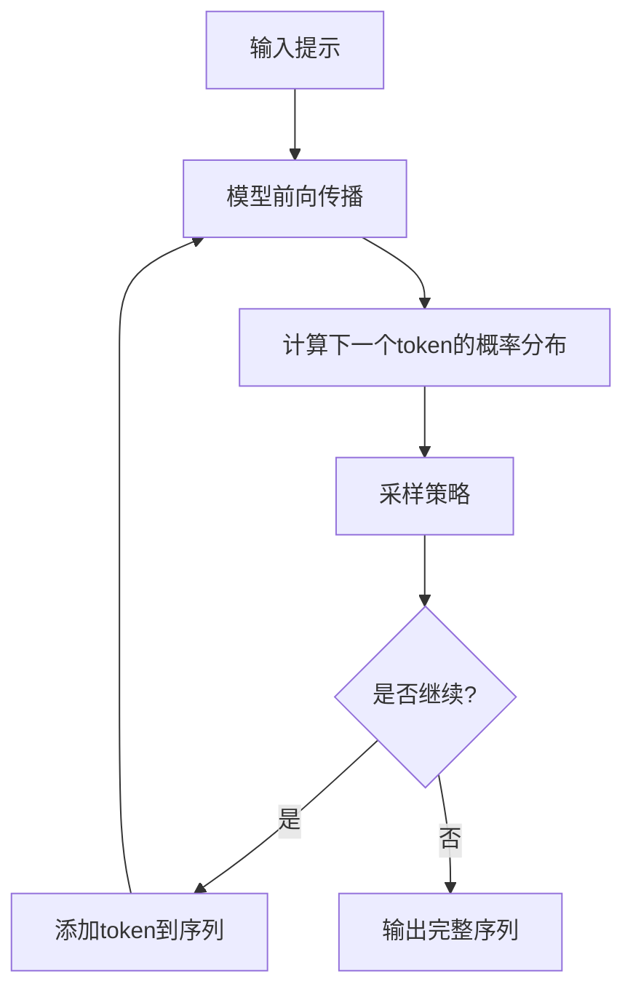

# 生成式推理的数学原理

## 从训练到推理

### 推理的本质

在训练阶段，模型学习的是条件概率分布 $P(x_t | x_{<t})$。在推理阶段，我们需要从这个分布中**采样**或**选择**最可能的token序列。

> **直观理解**：训练就像学习写作的规律，推理就像实际写作，根据学到的规律选择下一个词。

### 推理流程概览



## 基础采样策略

### 贪婪解码（Greedy Decoding）

#### 算法描述

贪婪解码每一步都选择概率最高的token。

> **直观理解**：就像做选择题，总是选你认为最正确的答案。

#### 优缺点

| 优点 | 缺点 |
|------|------|
| 简单高效 | 可能陷入局部最优 |
| 确定性输出 | 缺乏多样性 |
| 快速推理 | 可能生成重复内容 |

> **例子**：句子"The cat sat on the ___"，贪婪解码可能选择"mat"（概率最高），但"chair"、"floor"也是合理的选择。

### 束搜索（Beam Search）

#### 算法描述

束搜索维护 $k$ 个最优候选序列（束宽 $k$）。

> **直观理解**：就像找路，不是只走一条路，而是同时走几条路，然后选择最好的。

#### 长度归一化

为了避免偏向短序列，使用长度归一化。

> **直观理解**：就像评分，不能只看总分，还要看答题数量。长句子的总分可能高，但平均分不一定高。

### 核采样（Nucleus Sampling）

#### 算法描述

核采样（也称Top-p采样）从累积概率达到 $p$ 的最小集合中采样。

> **直观理解**：就像选词，从"最可能的词集合"中随机选一个。这个集合的大小由 $p$ 决定。

#### 可视化

假设概率分布为：[0.4, 0.3, 0.15, 0.1, 0.05]，设置 $p=0.8$：

累积概率：0.4, 0.7, 0.85, 0.95, 1.0

$\mathcal{V}_{0.8} = \{token1, token2, token3\}$（累积概率0.85 ≥ 0.8）

## 高级采样策略

### 温度采样

#### 算法描述

温度采样通过调整温度参数 $T$ 控制输出的随机性。

> **直观理解**：温度就像"创造性"的旋钮。温度低，输出更确定；温度高，输出更随机。

#### 温度的影响

| 温度 | 效果 | 适用场景 |
|------|------|----------|
| $T \to 0$ | 更确定，接近贪婪解码 | 需要精确答案 |
| $T = 1$ | 原始概率分布 | 通用场景 |
| $T > 1$ | 更随机，增加多样性 | 创意写作 |

> **例子**：温度低时，"今天天气真好"后面总是接"，我想出去玩"；温度高时，可能接"，我们去公园吧"、"，适合野餐"等。

### 重复惩罚（Repetition Penalty）

#### 问题

模型可能生成重复的词或短语，降低输出质量。

#### 解决方案

对已生成的token降低其概率。

> **直观理解**：就像写作时，避免重复用同一个词。如果已经用过"好"，下次用"好"的概率就降低。

## 推理优化技术

### KV缓存（KV Cache）

#### 问题

在自回归生成中，每一步都需要重新计算之前所有位置的注意力。

#### 解决方案

缓存之前步骤的键和值（K、V），只计算新位置的注意力。

> **直观理解**：就像做笔记，把之前计算的结果记下来，下次直接用，不用重新计算。

#### 效果

| 方法 | 计算复杂度 |
|------|-----------|
| 无缓存 | $O(t^2 \cdot d)$ |
| KV缓存 | $O(t \cdot d)$ |

### 量化（Quantization）

#### 原理

降低模型参数的精度，减少计算和存储开销。

| 精度 | 比特数 | 精度损失 | 速度提升 |
|------|--------|----------|----------|
| FP32 | 32 | 0% | 1x |
| FP16 | 16 | ~0.1% | 2x |
| INT8 | 8 | ~1% | 4x |

> **直观理解**：就像用低精度的计算器，虽然精度略低，但计算速度快很多。对于大模型来说，这点精度损失可以接受。

## 控制生成

### 停止条件

#### 常见停止条件

| 条件 | 描述 | 示例 |
|------|------|------|
| **结束符** | 生成到特殊token | `<EOS>`, `\n\n\n` |
| **最大长度** | 达到预设长度 | 512, 1024, 2048 |
| **关键词** | 遇到特定词停止 | "###", "---" |

### 提示工程（Prompt Engineering）

#### 提示设计

好的提示可以显著提升生成质量。

```
# 角色设定
你是一位专业的数据科学家。

# 任务描述
请解释什么是过拟合。

# 要求
1. 使用通俗易懂的语言
2. 举一个具体的例子
3. 给出解决方案
```

> **直观理解**：提示就像给模型"说明书"，说明书写得越清楚，模型的表现就越好。

#### 少样本学习（Few-shot Learning）

提供示例引导模型。

```
示例1：
输入：今天天气真好
输出：正面

示例2：
输入：这部电影太无聊了
输出：负面

输入：这个餐厅的食物还可以
输出：
```

> **直观理解**：就像给学生做例题，做完例题后，学生就能举一反三。

## 实践建议

### 策略选择

| 任务 | 推荐策略 | 参数 |
|------|----------|------|
| **代码生成** | 束搜索 | k=5 |
| **创意写作** | 核采样 | p=0.9, T=1.2 |
| **问答** | 贪婪解码 | - |
| **对话** | 核采样 | p=0.8, T=0.9 |

### 参数调优

1. **温度**：从1.0开始，根据需求调整
2. **Top-p**：通常0.8-0.95
3. **Top-k**：通常40-100
4. **重复惩罚**：通常1.0-1.5

## 小结

生成式推理是将预训练模型应用于实际任务的关键环节。通过选择合适的采样策略和优化技术，可以平衡生成质量、多样性和效率。

关键要点：
1. **基础采样策略**：贪婪解码、束搜索、核采样等
2. **温度采样**：控制输出的随机性
3. **KV缓存**：大幅提升推理速度
4. **提示工程**：好的提示显著提升生成质量
5. **策略选择**：不同任务需要不同的采样策略
6. **参数调优**：根据需求调整温度、Top-p等参数

> **核心洞察**：推理不是简单的"选择最高概率"，而是需要在质量、多样性、效率之间找到平衡。不同的任务需要不同的平衡点。

下一章，我们将探讨模型能力涌现的机制，理解为什么大规模模型会展现出令人惊讶的能力。
