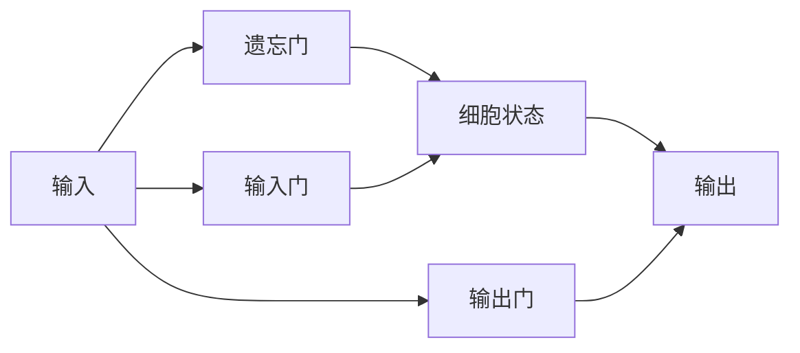

# 语言模型的数学基础

## 1. 语言建模的本质

### 1.1 概率视角下的语言序列

从数学角度理解，语言模型本质上是一个**条件概率分布**。给定一个文本序列 $x_1, x_2, \ldots, x_t$，语言模型的目标是预测下一个词 $x_{t+1}$ 的概率：

$$P(x_{t+1} | x_1, x_2, \ldots, x_t)$$

这被称为**自回归建模**（Autoregressive Modeling）。通过链式法则，整个序列的联合概率可以分解为：

$$P(x_1, x_2, \ldots, x_T) = \prod_{t=1}^{T} P(x_t | x_1, x_2, \ldots, x_{t-1})$$

> **直观理解**：想象你在阅读一本书，每读到一个词，你的大脑会根据前面读过的所有内容，预测下一个最可能出现的词。语言模型就是在数学上形式化这个过程。

### 1.2 语言模型的训练目标

训练语言模型的核心是**最大化似然估计**（Maximum Likelihood Estimation, MLE）。给定训练数据集 $\mathcal{D}$，我们寻找使数据出现概率最大的模型参数 $\theta$：

$$\theta^* = \arg\max_{\theta} \sum_{(x_1, \ldots, x_T) \in \mathcal{D}} \log P(x_1, \ldots, x_T | \theta)$$

等价于最小化**负对数似然**（Negative Log-Likelihood, NLL）：

$$\mathcal{L}(\theta) = -\sum_{(x_1, \ldots, x_T) \in \mathcal{D}} \sum_{t=1}^{T} \log P(x_t | x_1, \ldots, x_{t-1}; \theta)$$

### 1.3 困度（Perplexity）：衡量语言模型质量

**困惑度**（Perplexity, PPL）是评估语言模型性能的重要指标。对于测试集上的序列，困惑度定义为：

$$\text{PPL} = \exp\left(-\frac{1}{N} \sum_{i=1}^{N} \log P(x_i | \text{context}_i)\right)$$

其中 $N$ 是测试集中的总词数。

> **困惑度的直观解释**：困惑度可以理解为模型在预测下一个词时，平均有多少个"等可能的候选词"。困惑度越低，说明模型的预测越"确定"，质量越好。

例如，困惑度为10意味着模型平均在10个候选词中犹豫；困惑度为2意味着模型几乎确定下一个词。

## 2. 信息论基础

### 2.1 熵与语言的不确定性

**香农熵**（Shannon Entropy）衡量随机变量的不确定性。对于离散随机变量 $X$，熵定义为：

$$H(X) = -\sum_{x \in \mathcal{X}} P(x) \log_2 P(x)$$

在语言建模中，我们关心的是**条件熵**（Conditional Entropy），即在给定上下文条件下，下一个词的不确定性：

$$H(X_{t+1} | X_1, \ldots, X_t) = -\sum_{x_{t+1}} P(x_{t+1} | x_1, \ldots, x_t) \log_2 P(x_{t+1} | x_1, \ldots, x_t)$$

### 2.2 交叉熵与语言模型训练

**交叉熵**（Cross-Entropy）衡量两个概率分布之间的差异。在语言模型训练中，我们最小化模型预测分布与真实分布之间的交叉熵：

$$H(P, Q) = -\sum_{x} P(x) \log Q(x)$$

其中 $P$ 是真实分布（one-hot编码），$Q$ 是模型预测的分布。由于真实分布 $P$ 只在真实词的位置为1，交叉熵简化为：

$$H(P, Q) = -\log Q(x_{\text{true}})$$

这正是我们在训练时优化的目标！

### 2.3 KL散度与模型优化

**KL散度**（Kullback-Leibler Divergence）衡量两个分布的差异：

$$D_{KL}(P \| Q) = \sum_{x} P(x) \log \frac{P(x)}{Q(x)} = H(P, Q) - H(P)$$

由于 $H(P)$ 是常数（真实分布的熵），最小化交叉熵等价于最小化KL散度。

## 3. 语言模型的发展历程

### 3.1 N-gram模型：基于统计的朴素方法

N-gram模型假设下一个词只依赖于前 $n-1$ 个词：

$$P(x_t | x_1, \ldots, x_{t-1}) \approx P(x_t | x_{t-n+1}, \ldots, x_{t-1})$$

**优点**：简单、高效
**缺点**：无法捕捉长距离依赖、数据稀疏问题

### 3.2 神经语言模型：引入向量表示

Bengio等人于2003年提出神经语言模型，引入了**词嵌入**（Word Embedding）的概念：

$$P(x_t | x_1, \ldots, x_{t-1}) = \text{softmax}(g(C(x_{t-n+1}), \ldots, C(x_{t-1})))$$

其中 $C(\cdot)$ 是词嵌入函数，将词映射到连续向量空间。

**关键突破**：
- 词的分布式表示
- 缓解了数据稀疏问题
- 能够捕捉语义相似性

### 3.3 RNN/LSTM：序列建模的里程碑

循环神经网络（RNN）通过隐状态传递历史信息：

$$h_t = f(h_{t-1}, x_t)$$

长短期记忆网络（LSTM）引入门控机制，解决了梯度消失问题：

**LSTM的核心思想**：
- **遗忘门**：决定丢弃哪些历史信息
- **输入门**：决定存储哪些新信息
- **输出门**：决定输出哪些信息

### 3.4 Transformer：注意力机制的革命

Transformer完全抛弃了循环结构，通过**自注意力机制**（Self-Attention）直接建模序列中所有位置之间的关系：

$$\text{Attention}(Q, K, V) = \text{softmax}\left(\frac{QK^T}{\sqrt{d_k}}\right)V$$

这是现代大语言模型的基石，我们将在后续章节深入剖析。

## 4. 语言模型的能力边界

### 4.1 理论极限：语言的统计特性

从信息论角度看，自然语言的**熵率**（Entropy Rate）给出了语言模型性能的理论上限：

$$H_{\text{rate}} = \lim_{n \to \infty} \frac{1}{n} H(X_1, \ldots, X_n)$$

研究表明，英语的熵率约为 1.1-1.5 比特/字符，对应的困惑度约为 2.2-2.8。

### 4.2 实践挑战：计算与数据的权衡

| 挑战 | 描述 | 解决方案 |
|------|------|----------|
| 长距离依赖 | 模型难以关联相距很远的词 | 注意力机制、位置编码 |
| 上下文窗口 | 模型能处理的序列长度有限 | 滑动窗口、分层注意力 |
| 领域适应 | 通用模型在特定领域表现下降 | 微调、领域预训练 |
| 事实一致性 | 模型可能生成错误信息 | 检索增强、知识注入 |

### 4.3 从预测到理解：模型的涌现能力

当模型规模达到一定程度时，会展现出一些超出单纯预测的能力：

- **上下文学习**（In-context Learning）：无需参数更新，通过示例学习新任务
- **思维链推理**（Chain-of-Thought）：逐步推理解决复杂问题
- **指令遵循**（Instruction Following）：理解并执行自然语言指令

这些能力的数学本质仍然是概率分布的建模，但它们展示了规模带来的质变。

## 5. 数学工具箱

### 5.1 Softmax函数：将分数转换为概率

Softmax函数将任意实数向量转换为概率分布：

$$\text{softmax}(z_i) = \frac{e^{z_i}}{\sum_{j} e^{z_j}}$$

**特性**：
- 输出值在 $(0, 1)$ 之间
- 所有输出之和为1
- 可微，便于梯度优化

### 5.2 对数空间计算：数值稳定性

在实际计算中，直接使用指数可能导致数值溢出。我们使用**log-softmax**：

$$\log \text{softmax}(z_i) = z_i - \log\left(\sum_{j} e^{z_j}\right)$$

进一步使用**log-sum-exp技巧**：

$$\log\left(\sum_{j} e^{z_j}\right) = \max_j z_j + \log\left(\sum_{j} e^{z_j - \max_j z_j}\right)$$

### 5.3 温度参数：控制输出的随机性

在推理时，我们可以引入温度参数 $T$ 来调整输出的多样性：

$$P(x_t | \text{context}) = \frac{\exp(z_t / T)}{\sum_{j} \exp(z_j / T)}$$

- $T \to 0$：更确定，倾向于选择最高概率的词
- $T = 1$：原始概率分布
- $T \to \infty$：更随机，接近均匀分布

## 6. 小结

语言模型的数学基础建立在概率论和信息论之上。从简单的N-gram到复杂的Transformer，其核心思想始终是：**通过学习文本序列的统计规律，预测下一个最可能的词**。

关键要点：
1. 语言建模本质上是条件概率估计问题
2. 训练目标是最大化似然（最小化交叉熵）
3. 困惑度衡量模型预测的确定性
4. 信息论提供了评估模型性能的理论框架
5. 从RNN到Transformer的演进，核心是更好地捕捉长距离依赖

下一章，我们将深入探讨如何将文本转换为数学可处理的形式——文本的数学表示与编码。
