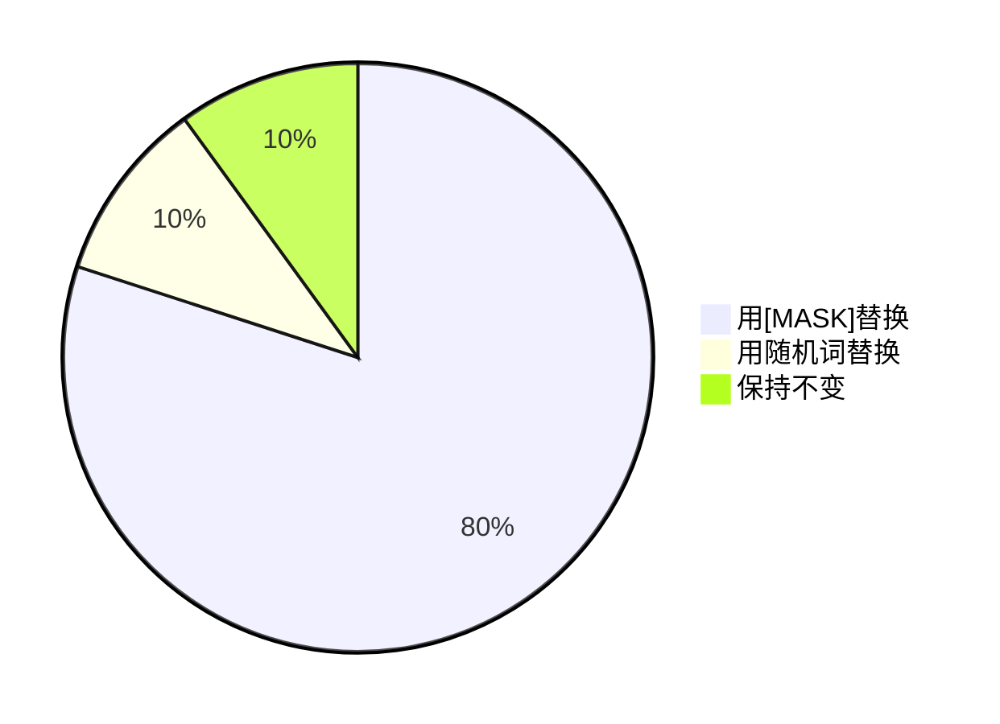
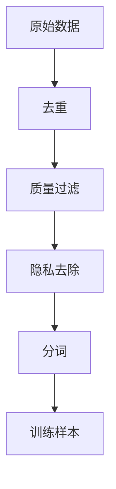
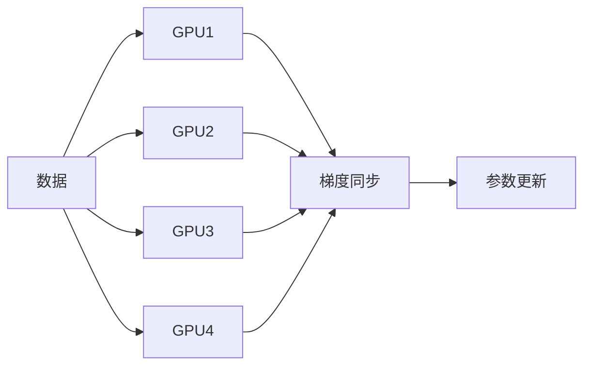

# 大规模预训练的原理

## 1. 预训练的本质与意义

### 1.1 什么是预训练？

**预训练**（Pre-training）是指在大量无标注数据上训练模型，使其学习通用的语言表示和知识。预训练后的模型可以通过**微调**（Fine-tuning）适应下游任务。

> **类比**：预训练就像让学生广泛阅读各种书籍，学习通用的知识和思维方式；微调就像针对特定考试进行专项训练。

### 1.2 预训练-微调范式

### 1.3 预训练的优势

| 优势 | 说明 |
|------|------|
| **数据效率**：利用海量无标注数据，降低对标注数据的依赖 |
| **知识迁移**：学到的通用知识可以迁移到多个下游任务 |
| **性能提升**：预训练模型通常比从头训练的模型表现更好 |
| **快速部署**：微调比从头训练快得多 |

## 2. 预训练目标函数

### 2.0 数学工具箱：Softmax与交叉熵

在深入预训练目标之前，我们先了解两个核心的数学工具。

#### 2.0.1 Softmax函数：将分数转换为概率

Softmax函数将任意实数向量转换为概率分布：

$$\text{softmax}(z_i) = \frac{e^{z_i}}{\sum_{j} e^{z_j}}$$

**特性**：
- 输出值在 $(0, 1)$ 之间
- 所有输出之和为1
- 可微，便于梯度优化

#### 2.0.2 对数空间计算：数值稳定性

在实际计算中，直接使用指数可能导致数值溢出。我们使用**log-softmax**：

$$\log \text{softmax}(z_i) = z_i - \log\left(\sum_{j} e^{z_j}\right)$$

进一步使用**log-sum-exp技巧**：

$$\log\left(\sum_{j} e^{z_j}\right) = \max_j z_j + \log\left(\sum_{j} e^{z_j - \max_j z_j}\right)$$

#### 2.0.3 交叉熵与模型优化

**交叉熵**（Cross-Entropy）衡量两个概率分布之间的差异。在语言模型训练中，我们最小化模型预测分布与真实分布之间的交叉熵：

$$H(P, Q) = -\sum_{x} P(x) \log Q(x)$$

其中 $P$ 是真实分布（one-hot编码），$Q$ 是模型预测的分布。由于真实分布 $P$ 只在真实词的位置为1，交叉熵简化为：

$$H(P, Q) = -\log Q(x_{\text{true}})$$

这正是我们在训练时优化的目标！

#### 2.0.4 KL散度

**KL散度**（Kullback-Leibler Divergence）衡量两个分布的差异：

$$D_{KL}(P \| Q) = \sum_{x} P(x) \log \frac{P(x)}{Q(x)} = H(P, Q) - H(P)$$

由于 $H(P)$ 是常数（真实分布的熵），最小化交叉熵等价于最小化KL散度。

### 2.1 自回归语言建模（Autoregressive LM）

#### 2.1.1 目标函数

自回归语言建模（也称为因果语言建模，Causal LM）的目标是预测序列中的下一个词：

$$\mathcal{L}_{\text{AR}} = -\sum_{t=1}^{T} \log P(x_t | x_{<t})$$

其中 $x_{<t} = (x_1, x_2, \ldots, x_{t-1})$ 是前 $t-1$ 个词。

#### 2.1.2 因果掩码

为了确保模型只能看到之前的词，使用因果掩码：

$$M_{ij} = \begin{cases}
0 & \text{if } i \geq j \\
-\infty & \text{if } i < j
\end{cases}$$

$$\text{Attention}(\mathbf{Q}, \mathbf{K}, \mathbf{V}) = \text{softmax}\left(\frac{\mathbf{Q}\mathbf{K}^T}{\sqrt{d_k}} + \mathbf{M}\right)\mathbf{V}$$

#### 2.1.3 代表模型

| 模型 | 架构 | 特点 |
|------|------|------|
| **GPT系列** | 仅解码器 | 自回归生成 |
| **LLaMA系列** | 仅解码器 | 开源、高效 |
| **PaLM** | 仅解码器 | 大规模、多模态 |

> **优势**：适合生成任务，训练目标简单直接

### 2.2 掩码语言建模（Masked Language Modeling）

#### 2.2.1 目标函数

掩码语言建模（MLM）随机掩盖部分token，要求模型预测被掩盖的词：

$$\mathcal{L}_{\text{MLM}} = -\sum_{i \in \mathcal{M}} \log P(x_i | \mathbf{x}_{\setminus \mathcal{M}})$$

其中 $\mathcal{M}$ 是被掩盖的token集合。

#### 2.2.2 掩码策略

原始BERT使用以下掩码策略：

- **80%**：用`[MASK]`token替换
- **10%**：用随机词替换
- **10%**：保持不变

> **为什么这样设计？** 如果只用`[MASK]`，训练和推理时输入分布不一致；加入随机替换和保持不变可以缓解这个问题。

#### 2.2.3 代表模型

| 模型 | 架构 | 特点 |
|------|------|------|
| **BERT** | 仅编码器 | 双向上下文 |
| **RoBERTa** | 仅编码器 | 优化训练策略 |
| **DeBERTa** | 仅编码器 | 解耦注意力 |

> **优势**：能够利用双向上下文，适合理解任务

### 2.3 序列到序列语言建模（Seq2Seq LM）

#### 2.3.1 目标函数

序列到序列语言建模结合了编码器和解码器：

$$\mathcal{L}_{\text{Seq2Seq}} = -\sum_{t=1}^{T} \log P(y_t | y_{<t}, \mathbf{x})$$

其中 $\mathbf{x}$ 是输入序列，$\mathbf{y}$ 是目标序列。

#### 2.3.2 前缀语言建模（Prefix LM）

前缀LM允许模型看到输入的完整序列，但只能自回归生成输出：

$$P(y_t | \mathbf{x}, y_{<t})$$

#### 2.3.3 代表模型

| 模型 | 架构 | 特点 |
|------|------|------|
| **T5** | 编码器-解码器 | 文本到文本 |
| **BART** | 编码器-解码器 | 去噪自编码 |
| **GLM** | 仅解码器 | 前缀LM |

> **优势**：适合翻译、摘要等序列到序列任务

### 2.4 其他预训练目标

#### 2.4.1 下一个句子预测（NSP）

BERT使用的辅助任务，判断两个句子是否连续：

$$P(\text{is\_next} | \mathbf{x}_A, \mathbf{x}_B)$$

**争议**：后续研究表明NSP对性能提升有限，RoBERTa等模型移除了这个任务。

#### 2.4.2 排列语言建模（Permutation LM）

XLNet使用的方法，随机排列序列顺序：

$$\mathcal{L}_{\text{PLM}} = -\sum_{t=1}^{T} \log P(x_{z_t} | x_{z_{<t}})$$

其中 $\mathbf{z}$ 是随机排列。

#### 2.4.3 对比学习

使用对比学习学习更好的表示：

$$\mathcal{L}_{\text{CL}} = -\log \frac{\exp(\text{sim}(h, h^+)/\tau)}{\sum_{h^-} \exp(\text{sim}(h, h^-)/\tau)}$$

其中 $h^+$ 是正样本，$h^-$ 是负样本。

## 3. 预训练数据

### 3.1 数据来源

| 数据类型 | 来源 | 特点 |
|---------|------|------|
| **网页文本** | Common Crawl | 规模大、质量参差不齐 |
| **书籍** | Project Gutenberg, Google Books | 质量高、风格正式 |
| **维基百科** | 多语言百科全书 | 结构化、事实性强 |
| **代码** | GitHub, Stack Overflow | 逻辑性强、语法规范 |
| **对话数据** | Reddit, Twitter | 口语化、非正式 |

### 3.2 数据处理流程

#### 3.2.1 去重

去除重复内容，避免模型过度学习重复模式：

- **精确去重**：完全相同的文本
- **模糊去重**：相似度高的文本（如MinHash）

#### 3.2.2 质量过滤

基于启发式规则过滤低质量文本：

- **长度过滤**：过短或过长的文本
- **语言检测**：非目标语言的文本
- **启发式规则**：过多的标点、特殊字符等

#### 3.2.3 隐私去除

去除个人隐私信息：

- **邮箱、电话、身份证号**
- **地址、姓名**
- **信用卡号等敏感信息**

### 3.3 数据规模

| 模型 | 训练数据量 | 数据类型 |
|------|-----------|----------|
| **GPT-3** | 300B tokens | 网页、书籍、维基百科 |
| **LLaMA-2** | 2T tokens | 网页、书籍、代码 |
| **PaLM** | 780B tokens | 网页、书籍、对话、代码 |
| **GPT-4** | 未公开（估计>10T） | 多模态数据 |

## 4. 预训练的优化策略

### 4.1 学习率调度

#### 4.1.1 学习率预热（Warmup）

初始阶段线性增加学习率：

$$\eta_t = \min\left(\eta_{\max}, \frac{t}{T_{\text{warmup}}} \cdot \eta_{\max}\right)$$

**作用**：稳定训练初期，避免梯度爆炸。

#### 4.1.2 余弦退火（Cosine Decay）

训练后期平滑降低学习率：

$$\eta_t = \eta_{\min} + \frac{1}{2}(\eta_{\max} - \eta_{\min})\left(1 + \cos\left(\frac{t}{T}\pi\right)\right)$$

#### 4.1.3 恒定学习率

大模型训练时，预热后保持恒定学习率：

$$\eta_t = \begin{cases}
\frac{t}{T_{\text{warmup}}} \cdot \eta_{\max} & \text{if } t < T_{\text{warmup}} \\
\eta_{\max} & \text{otherwise}
\end{cases}$$

### 4.2 批次大小（Batch Size）

#### 4.2.1 批次大小的影响

| 批次大小 | 优点 | 缺点 |
|---------|------|------|
| **小批次** | 更新频繁、泛化好 | 噪声大、效率低 |
| **大批次** | 效率高、训练稳定 | 泛化可能下降 |

#### 4.2.2 批次大小的扩展

研究表明，批次大小可以线性扩展，但需要相应调整学习率：

$$\eta_{\text{new}} = \eta_{\text{base}} \cdot \frac{B_{\text{new}}}{B_{\text{base}}}$$

### 4.3 梯度累积

当显存不足以容纳大批次时，使用梯度累积：

$$\mathbf{g} = \sum_{i=1}^{k} \nabla \mathcal{L}(\mathbf{x}_i)$$

等效批次大小 = 微批次大小 × 累积步数。

### 4.4 混合精度训练

使用FP16/BF16进行训练，降低显存占用和加速计算：

- **FP16**：半精度浮点数，范围小
- **BF16**：脑浮点数，范围与FP32相同，精度较低

**损失缩放**：防止梯度下溢：

$$\mathbf{g}_{\text{scaled}} = \text{scale} \cdot \mathbf{g}$$

### 4.5 分布式训练

#### 4.5.1 数据并行

将数据分片到多个GPU：

#### 4.5.2 张量并行

将模型参数分片到多个GPU：

- **行并行**：按行分割权重矩阵
- **列并行**：按列分割权重矩阵

#### 4.5.3 流水线并行

将模型层分布到多个GPU：

## 5. 预训练的挑战与解决方案

### 5.1 计算资源需求

| 资源 | 需求 | 优化方法 |
|------|------|----------|
| **GPU** | 数千到数万张 | 使用更高效的硬件 |
| **显存** | 数十TB | 梯度检查点、ZeRO |
| **电力** | 数MWh | 绿色计算、碳足迹优化 |

### 5.2 训练稳定性

#### 5.2.1 梯度爆炸/消失

**解决方案**：
- 梯度裁剪
- 层归一化
- 残差连接

#### 5.2.2 损失尖峰

训练过程中损失突然上升，可能导致训练失败。

**解决方案**：
- 降低学习率
- 使用更稳定的优化器
- 检查数据质量

### 5.3 数据质量

低质量数据会影响模型性能：

**解决方案**：
- 严格的数据过滤
- 人工审核
- 质量评分模型

### 5.4 过拟合

在大规模数据上，过拟合不是主要问题，但仍然需要注意：

**解决方案**：
- 增加数据量
- 使用正则化（Dropout、权重衰减）
- 早停（Early Stopping）

## 6. 预训练的评估

### 6.1 困度（Perplexity）

衡量模型预测的确定性：

$$\text{PPL} = \exp\left(-\frac{1}{N} \sum_{i=1}^{N} \log P(x_i | \text{context}_i)\right)$$

### 6.2 下游任务评估

在标准基准上评估：

| 任务类型 | 基准 | 示例 |
|---------|------|------|
| **语言理解** | GLUE, SuperGLUE | MNLI, QQP, SST-2 |
| **问答** | SQuAD, NaturalQuestions | 阅读理解 |
| **生成** | CNN/DailyMail, XSum | 文本摘要 |
| **推理** | HellaSwag, PIQA | 常识推理 |

### 6.3 人类评估

对于生成任务，人类评估是金标准：

- **流畅性**：文本是否自然流畅
- **连贯性**：文本是否逻辑连贯
- **事实性**：内容是否准确
- **有用性**：回答是否有帮助

## 7. 预训练的扩展法则

### 7.1 Chinchilla扩展法则

DeepMind的研究表明，最优的参数量和数据量应保持一定比例：

$$N_{\text{opt}} \propto D_{\text{opt}}$$

其中 $N$ 是参数量，$D$ 是数据量。

**关键发现**：
- 给定计算预算，应同时增加参数量和数据量
- 过度训练小模型不如适度训练大模型

### 7.2 计算最优训练

给定计算预算 $C$，最优的参数量和数据量：

$$N^* \approx \left(\frac{C}{6}\right)^{0.5}$$
$$D^* \approx 20 \cdot N^*$$

### 7.3 推理最优训练

如果考虑推理成本，应训练更小的模型，但用更多数据：

$$N_{\text{inference-optimal}} < N_{\text{compute-optimal}}$$

## 8. 预训练的实践建议

### 8.1 数据准备

- **多样化数据源**：覆盖不同领域和风格
- **严格去重**：避免重复内容
- **质量过滤**：去除低质量文本
- **隐私保护**：去除敏感信息

### 8.2 训练配置

| 配置 | 建议 |
|------|------|
| **学习率** | 1e-4 到 5e-4 |
| **批次大小** | 尽可能大（如2M tokens） |
| **预热步数** | 2000-10000步 |
| **权重衰减** | 0.01-0.1 |
| **Dropout** | 0.0-0.1 |

### 8.3 监控与调试

- **损失曲线**：检查是否正常下降
- **梯度统计**：监控梯度范数
- **学习率**：跟踪学习率变化
- **显存使用**：优化显存占用

### 8.4 检查点管理

- **定期保存**：每N步保存检查点
- **最佳模型**：保存验证集上表现最好的模型
- **增量保存**：只保存参数变化

## 9. 小结

大规模预训练是构建强大语言模型的关键步骤。通过在大量无标注数据上训练，模型能够学习到丰富的语言知识和世界知识。

关键要点：
1. 预训练目标包括自回归LM、掩码LM、序列到序列LM等
2. 数据处理包括去重、质量过滤、隐私去除等步骤
3. 优化策略包括学习率调度、批次大小、混合精度等
4. 分布式训练是训练大模型的必要手段
5. 扩展法则指导参数量和数据量的选择
6. 预训练模型需要通过多种方式评估
7. 实践中需要注意数据质量、训练稳定性等问题

下一章，我们将探讨如何利用预训练模型进行生成式推理，理解模型如何生成连贯、有意义的文本。
