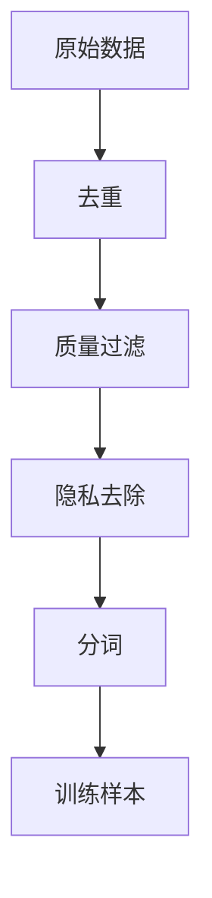

# 大规模预训练的原理

## 什么是预训练？

预训练（Pre-training）是指在大量无标注数据上训练模型，使其学习通用的语言表示和知识。

> **直观理解**：预训练就像让学生广泛阅读各种书籍，学习通用的知识和思维方式；微调就像针对特定考试进行专项训练。

### 预训练-微调范式


### 预训练的优势

| 优势 | 直观理解 |
|------|----------|
| **数据效率** | 利用海量无标注数据，就像让学生读很多书 |
| **知识迁移** | 学到的通用知识可以迁移到多个任务，就像通识教育 |
| **性能提升** | 预训练模型通常比从头训练的模型表现更好 |
| **快速部署** | 微调比从头训练快得多，就像考前突击比从头学快 |

## 预训练目标：模型学什么？

预训练的核心是设计一个"任务"，让模型在学习这个任务的过程中，自然而然地学会语言知识。

### 自回归语言建模（Autoregressive LM）

#### 目标

自回归语言建模的目标是**预测序列中的下一个词**。

> **直观理解**：就像你在阅读一本书，每读到一个词，你的大脑会根据前面读过的所有内容，预测下一个最可能出现的词。

#### 训练过程

让我们用"今天天气真好，我想出去玩"这个例子来说明。

**训练样本1**：
```
输入：今天
目标：天气
```

模型看到"今天"，需要预测"天气"。

**训练样本2**：
```
输入：今天天气
目标：真
```

模型看到"今天天气"，需要预测"真"。

**训练样本3**：
```
输入：今天天气真
目标：好
```

模型看到"今天天气真"，需要预测"好"。

以此类推...

#### 模型学到了什么？

通过这个任务，模型学会了：
- **语法**："今天"后面通常接名词（"天气"）
- **语义**："天气"后面通常接形容词（"真好"）
- **常识**："天气真好"后面通常接"我想出去玩"这样的表达
- **世界知识**：知道"天气"是什么，"出去玩"是什么意思

> **关键洞察**：仅仅通过"预测下一个词"这个简单任务，模型就能学会复杂的语言知识！

#### 代表模型

| 模型 | 架构 | 特点 |
|------|------|------|
| **GPT系列** | 仅解码器 | 自回归生成 |
| **LLaMA系列** | 仅解码器 | 开源、高效 |
| **PaLM** | 仅解码器 | 大规模、多模态 |

### 掩码语言建模（Masked Language Modeling）

#### 目标

掩码语言建模（MLM）随机掩盖部分token，要求模型预测被掩盖的词。

> **直观理解**：就像做填空题，给你一个句子，其中某些词被挖掉了，你需要根据上下文填上正确的词。

#### 训练过程

让我们用"今天天气真好，我想出去玩"这个例子。

**训练样本**：
```
输入：今天[MASK]真好，我想出去玩
目标：天气
```

模型看到"今天[MASK]真好，我想出去玩"，需要预测[MASK]是"天气"。

**另一个训练样本**：
```
输入：今天天气[MASK]，我想出去玩
目标：真
```

模型看到"今天天气[MASK]，我想出去玩"，需要预测[MASK]是"真"。

#### 掩码策略

为了防止模型"偷懒"，BERT使用以下掩码策略：

- **80%**：用`[MASK]`token替换
- **10%**：用随机词替换
- **15%**：保持不变

> **为什么这样设计？** 如果只用`[MASK]`，训练时总是看到`[MASK]`，但推理时没有`[MASK]`，模型会困惑。加入随机替换和保持不变，让模型适应推理时的输入分布。

#### 模型学到了什么？

通过这个任务，模型学会了：
- **上下文理解**：需要同时看左边和右边才能填空
- **双向推理**：可以从前后两个方向理解句子
- **语法和语义**：和自回归LM类似

> **与自回归LM的区别**：自回归LM只能看到左边，MLM可以看到左右两边。这让MLM更适合理解任务。

#### 代表模型

| 模型 | 架构 | 特点 |
|------|------|------|
| **BERT** | 仅编码器 | 双向上下文 |
| **RoBERTa** | 仅编码器 | 优化训练策略 |
| **DeBERTa** | 仅编码器 | 解耦注意力 |

### 序列到序列语言建模（Seq2Seq LM）

#### 目标

序列到序列语言建模结合了编码器和解码器，适合输入和输出都是序列的任务。

> **直观理解**：就像翻译，给你一个中文句子，需要翻译成英文。编码器理解中文，解码器生成英文。

#### 训练过程

让我们用翻译为例。

**训练样本**：
```
输入：今天天气真好
目标：The weather is nice today
```

编码器看到"今天天气真好"，解码器生成"The weather is nice today"。

#### 代表模型

| 模型 | 架构 | 特点 |
|------|------|------|
| **T5** | 编码器-解码器 | 文本到文本 |
| **BART** | 编码器-解码器 | 去噪自编码 |
| **GLM** | 仅解码器 | 前缀LM |

## 预训练数据：模型读什么书？

预训练数据的质量和规模直接影响模型的能力。

### 数据来源

| 数据类型 | 来源 | 特点 |
|---------|------|------|
| **网页文本** | Common Crawl | 规模大、质量参差不齐 |
| **书籍** | Project Gutenberg, Google Books | 质量高、风格正式 |
| **维基百科** | 多语言百科全书 | 结构化、事实性强 |
| **代码** | GitHub, Stack Overflow | 逻辑性强、语法规范 |
| **对话数据** | Reddit, Twitter | 口语化、非正式 |

> **直观理解**：就像给学生选书，需要不同类型的书——百科全书（事实）、小说（创意）、教科书（知识）、对话（口语）等。

### 数据处理流程



#### 去重

去除重复内容，避免模型过度学习重复模式。

> **直观理解**：就像给学生选书，不会选十本一模一样的书。重复内容会让模型"记住"而不是"理解"。

#### 质量过滤

基于启发式规则过滤低质量文本。

- **长度过滤**：过短或过长的文本
- **语言检测**：非目标语言的文本
- **启发式规则**：过多的标点、特殊字符等

> **直观理解**：就像给学生选书，不会选破损的书、乱码的书、广告传单等。

#### 隐私去除

去除个人隐私信息。

- **邮箱、电话、身份证号**
- **地址、姓名**
- **信用卡号等敏感信息**

> **为什么重要？** 模型可能会"记住"训练数据，如果训练数据包含隐私信息，可能会在推理时泄露。

### 数据规模

| 模型 | 训练数据量 | 直观理解 |
|------|-----------|----------|
| **GPT-3** | 300B tokens | 相当于阅读约2亿本书 |
| **LLaMA-2** | 2T tokens | 相当于阅读约13亿本书 |
| **PaLM** | 780B tokens | 相当于阅读约5亿本书 |
| **GPT-4** | 未公开（估计>10T） | 相当于阅读约60亿本书 |

> **直观理解**：数据量越大，模型"读的书"越多，学到的知识就越丰富。

## 预训练的优化：如何高效训练？

训练大模型需要大量的计算资源，需要使用各种优化技术。

### 学习率调度

#### 学习率预热（Warmup）

初始阶段线性增加学习率。

> **直观理解**：就像开车，起步时不能猛踩油门，需要慢慢加速，否则会失控。

#### 余弦退火（Cosine Decay）

训练后期平滑降低学习率。

> **直观理解**：就像跑步，快到终点时慢慢减速，平稳停下。

#### 恒定学习率

大模型训练时，预热后保持恒定学习率。

> **直观理解**：就像高速公路上匀速行驶，效率最高。

### 批次大小（Batch Size）

#### 批次大小的影响

| 批次大小 | 优点 | 缺点 |
|---------|------|------|
| **小批次** | 更新频繁、泛化好 | 噪声大、效率低 |
| **大批次** | 效率高、训练稳定 | 泛化可能下降 |

> **直观理解**：小批次就像一次吃一口饭，大批次就像一次吃一碗饭。一口一口吃更细致，一碗一碗吃更高效。

### 混合精度训练

使用FP16/BF16进行训练，降低显存占用和加速计算。

> **直观理解**：就像用低精度的计算器，虽然精度略低，但计算速度快很多。对于大模型来说，这点精度损失可以接受。

### 分布式训练

#### 数据并行

将数据分片到多个GPU。

> **直观理解**：就像多个人同时读书，每个人读不同的部分，然后交流心得。

#### 张量并行

将模型参数分片到多个GPU。

> **直观理解**：就像把一本书撕成几份，每人读一部分，然后拼起来理解。

#### 流水线并行

将模型层分布到多个GPU。

> **直观理解**：就像流水线作业，第一个人负责第一层，第二个人负责第二层，依次传递。

## 预训练的挑战：会遇到什么问题？

### 计算资源需求

| 资源 | 需求 | 直观理解 |
|------|------|----------|
| **GPU** | 数千到数万张 | 需要很多"工人" |
| **显存** | 数十TB | 需要很大的"工作台" |
| **电力** | 数MWh | 需要很多"电费" |

### 训练稳定性

#### 梯度爆炸/消失

**问题**：梯度变得太大或太小，导致训练失败。

**解决方案**：
- 梯度裁剪
- 层归一化
- 残差连接

> **直观理解**：梯度就像声音，太大（爆炸）会震破耳膜，太小（消失）听不见。需要控制音量。

#### 损失尖峰

训练过程中损失突然上升，可能导致训练失败。

> **直观理解**：就像开车突然遇到坑，车身剧烈震动。需要减速或者绕开。

### 数据质量

低质量数据会影响模型性能。

> **直观理解**：就像给学生选书，如果选了错误的书，学生就会学到错误的知识。

## 预训练的评估：模型学得怎么样？

### 困度（Perplexity）

衡量模型预测的确定性。

> **直观理解**：困惑度可以理解为模型在预测下一个词时，平均有多少个"等可能的候选词"。困惑度越低，说明模型的预测越"确定"，质量越好。

例如，困惑度为10意味着模型平均在10个候选词中犹豫；困惑度为2意味着模型几乎确定下一个词。

### 下游任务评估

在标准基准上评估。

| 任务类型 | 基准 | 示例 |
|---------|------|------|
| **语言理解** | GLUE, SuperGLUE | MNLI, QQP, SST-2 |
| **问答** | SQuAD, NaturalQuestions | 阅读理解 |
| **生成** | CNN/DailyMail, XSum | 文本摘要 |
| **推理** | HellaSwag, PIQA | 常识推理 |

### 人类评估

对于生成任务，人类评估是金标准。

- **流畅性**：文本是否自然流畅
- **连贯性**：文本是否逻辑连贯
- **事实性**：内容是否准确
- **有用性**：回答是否有帮助

## 扩展法则：投入越多，回报越大？

研究表明，模型性能遵循**扩展法则**（Scaling Laws）。

> **直观理解**：就像投资，投入越多（参数量、数据量、计算量），回报越大（性能越好）。而且这种关系是可以预测的，不是随机的。

### 关键发现

1. **损失随参数量和数据量的增加而下降**
2. **性能可以预测（幂律关系）**
3. **三要素协同优化**：参数量、数据量、计算量

### 计算最优训练

给定计算预算，最优的参数量和数据量应保持一定比例。

> **直观理解**：就像预算有限，需要平衡买多少书（数据量）和请多少老师（参数量）。不能只买书不请老师，也不能只请老师不买书。

## 小结

大规模预训练是构建强大语言模型的关键步骤。通过在大量无标注数据上训练，模型能够学习到丰富的语言知识和世界知识。

关键要点：
1. **预训练目标**：自回归LM（预测下一个词）、掩码LM（填空）、序列到序列LM（翻译）
2. **数据来源**：网页、书籍、维基百科、代码、对话等
3. **数据处理**：去重、质量过滤、隐私去除
4. **优化技术**：学习率调度、批次大小、混合精度、分布式训练
5. **挑战**：计算资源、训练稳定性、数据质量
6. **评估方法**：困度、下游任务、人类评估
7. **扩展法则**：投入越多，性能越好，且可预测

> **核心洞察**：仅仅通过"预测下一个词"或"填空"这样简单的任务，模型就能学会复杂的语言知识。这就是预训练的神奇之处！

现在，我们理解了如何训练大语言模型。下一章，我们将探讨如何利用预训练模型进行生成式推理，理解模型如何生成连贯、有意义的文本。
