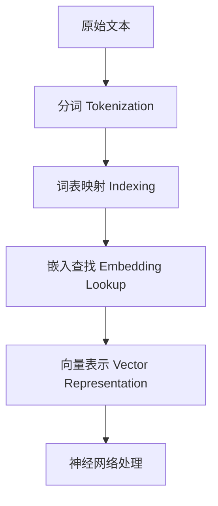
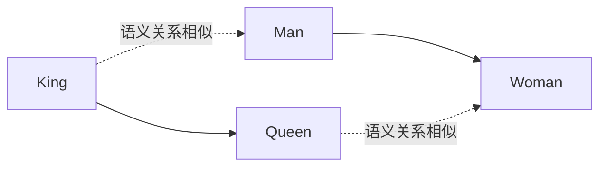
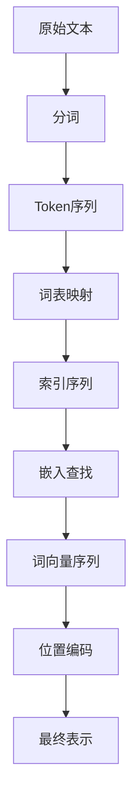

# 文本的数学表示与编码

## 1. 从符号到向量：文本的数字化

### 1.1 文本表示的挑战

计算机无法直接理解自然语言文本，因为文本是离散的符号序列。为了让神经网络处理文本，我们需要将其转换为**数值向量**。这个转换过程面临几个核心挑战：

| 挑战 | 描述 | 影响 |
|------|------|------|
| **离散性** | 词是离散符号，缺乏内在的数值关系 | 无法直接应用数学运算 |
| **高维性** | 词汇表可能包含数万到数十万个词 | 计算和存储开销大 |
| **稀疏性** | 任何特定文本只使用词汇表的一小部分 | 大量零值，效率低下 |
| **语义鸿沟** | 符号本身不携带语义信息 | 需要从数据中学习语义 |

### 1.2 语言建模的本质

从数学角度理解，语言模型本质上是一个**条件概率分布**。给定一个文本序列 $x_1, x_2, \ldots, x_t$，语言模型的目标是预测下一个词 $x_{t+1}$ 的概率：

$$P(x_{t+1} | x_1, x_2, \ldots, x_t)$$

这被称为**自回归建模**（Autoregressive Modeling）。通过链式法则，整个序列的联合概率可以分解为：

$$P(x_1, x_2, \ldots, x_T) = \prod_{t=1}^{T} P(x_t | x_1, x_2, \ldots, x_{t-1})$$

> **直观理解**：想象你在阅读一本书，每读到一个词，你的大脑会根据前面读过的所有内容，预测下一个最可能出现的词。语言模型就是在数学上形式化这个过程。

### 1.3 困度（Perplexity）：衡量语言模型质量

**困惑度**（Perplexity, PPL）是评估语言模型性能的重要指标。对于测试集上的序列，困惑度定义为：

$$\text{PPL} = \exp\left(-\frac{1}{N} \sum_{i=1}^{N} \log P(x_i | \text{context}_i)\right)$$

其中 $N$ 是测试集中的总词数。

> **困惑度的直观解释**：困惑度可以理解为模型在预测下一个词时，平均有多少个"等可能的候选词"。困惑度越低，说明模型的预测越"确定"，质量越好。

例如，困惑度为10意味着模型平均在10个候选词中犹豫；困惑度为2意味着模型几乎确定下一个词。

### 1.4 文本处理的基本流程



## 2. 分词：文本的切分艺术

### 2.1 分词的定义与目标

**分词**（Tokenization）是将连续的文本切分为离散的**词元**（Token）序列。分词的目标是：

1. **语义完整性**：每个token尽可能承载完整的语义单位
2. **效率平衡**：控制词汇表大小，避免过大或过小
3. **覆盖率**：尽可能覆盖训练和推理时遇到的所有词

### 2.2 分词方法的演进

#### 2.2.1 字符级分词

将文本拆分为单个字符：

```
"Hello world" → ['H', 'e', 'l', 'l', 'o', ' ', 'w', 'o', 'r', 'l', 'd']
```

**优点**：
- 词汇表极小（通常只有几十到几百个字符）
- 不会出现OOV（Out-of-Vocabulary）问题
- 能处理任意文本

**缺点**：
- 序列长度大幅增加，计算效率低
- 缺乏词级别的语义信息

#### 2.2.2 词级分词

以空格和标点符号为边界切分：

```
"Hello world!" → ['Hello', 'world', '!']
```

**优点**：
- 语义单位相对完整
- 序列长度适中

**缺点**：
- 词汇表庞大（可能数十万）
- OOV问题严重（生僻词、新词、拼写错误）
- 无法处理词形变化（run, runs, running）

#### 2.2.3 子词分词：现代LLM的标准

子词分词在字符和词之间取得平衡，将词拆分为有意义的子词单元。最著名的是**字节对编码**（Byte Pair Encoding, BPE）。

### 2.3 字节对编码（BPE）原理

BPE是一种**数据压缩算法**，被应用于分词。其核心思想是：**迭代地合并最频繁出现的字符对**。

#### 2.3.1 BPE算法步骤

**步骤1：初始化**
将每个字符作为独立的token，统计所有字符对的频率。

**步骤2：迭代合并**
1. 找到出现频率最高的字符对
2. 将该字符对合并为一个新的token
3. 更新词汇表和字符对频率统计
4. 重复直到达到目标词汇表大小

#### 2.3.2 BPE示例

假设我们要对以下文本进行BPE分词：
```
"low low low low lowest lowest newer newer newer newer newer wider wider wider"
```

**初始状态**（字符级）：
```
词汇表: {'l', 'o', 'w', 'e', 'r', 'n', 'i', 'd', ' ', 's', 't'}
```

**第一次迭代**：合并最频繁的字符对 'e' + 'r' → 'er'
```
"low low low low low<er>st low<er>st n<e>w<er> n<e>w<er> n<e>w<er> n<e>w<er> wid<er> wid<er> wid<er>"
```

**第二次迭代**：合并 'l' + 'o' → 'lo'
```
"<lo>w <lo>w <lo>w <lo>w <lo><er>st <lo><er>st n<e>w<er> n<e>w<er> n<e>w<er> n<e>w<er> n<e>w<er> wid<er> wid<er> wid<er>"
```

**第三次迭代**：合并 'lo' + 'w' → 'low'
```
"low low low low low<er>st low<er>st n<e>w<er> n<e>w<er> n<e>w<er> n<e>w<er> n<e>w<er> wid<er> wid<er> wid<er>"
```

继续迭代，最终得到类似：
```
词汇表: {'low', 'low', 'er', 'st', 'new', 'er', 'wid', 'er', ' ', ...}
```

最终分词结果：
```
['low', 'low', 'low', 'low', 'low', 'er', 'st', 'low', 'er', 'st', 'new', 'er', ...]
```

> **直观理解**：BPE就像在拼积木，开始有很多小积木（字符），我们不断把经常一起出现的小积木粘成大积木（子词），最后用这些大积木来表示文本。

#### 2.3.3 BPE的数学表示

给定训练语料，BPE的目标是找到最优的合并序列，使得：

$$\min_{\text{merge sequence}} \sum_{x \in \mathcal{D}} |\text{tokenize}(x)|$$

即在保证覆盖所有文本的前提下，使token总数最小。

### 2.4 其他子词分词方法

| 方法 | 核心思想 | 特点 |
|------|----------|------|
| **WordPiece** | 最大化训练数据的似然 | Google BERT使用 |
| **Unigram Language Model** | 基于语言模型选择最优子词 | Google T5、ALBERT使用 |
| **SentencePiece** | 统一处理空格，端到端训练 | 多种模型使用 |

## 3. 词表映射：从token到索引

### 3.1 词表的构建

词表（Vocabulary）是所有可能token的集合，通常按频率排序：

```python
vocabulary = {
    '<pad>': 0,      # 填充符
    '<unk>': 1,      # 未知词
    '<bos>': 2,      # 句子开始
    '<eos>': 3,      # 句子结束
    'the': 4,
    'of': 5,
    'and': 6,
    ...
}
```

### 3.2 特殊token的作用

| Token | 用途 | 示例 |
|-------|------|------|
| `<pad>` | 填充序列到相同长度 | 批处理时对齐不同长度的序列 |
| `<unk>` | 表示词表外的token | 处理OOV词 |
| `<bos>` | 标记序列开始 | 指示生成任务的起点 |
| `<eos>` | 标记序列结束 | 指示生成任务的终点 |
| `<mask>` | 掩码位置 | BERT的掩码语言建模 |

### 3.3 序列长度与上下文窗口

现代大语言模型通常使用固定的**上下文窗口**（Context Window）：

| 模型 | 上下文窗口 |
|------|-----------|
| GPT-3 | 2048 |
| GPT-4 | 8192-32768 |
| Claude | 100000+ |
| LLaMA | 2048-4096 |

序列长度 $L$ 的选择需要权衡：
- **太短**：无法捕捉长距离依赖
- **太长**：计算复杂度呈二次增长（注意力机制）

## 4. 词嵌入：从索引到向量

### 4.1 词嵌入的本质

**词嵌入**（Word Embedding）将离散的词索引映射到连续的向量空间：

$$\mathbf{e}_i = \mathbf{E}[i] \in \mathbb{R}^{d_{\text{model}}}$$

其中：
- $\mathbf{E} \in \mathbb{R}^{|\mathcal{V}| \times d_{\text{model}}}$ 是嵌入矩阵
- $|\mathcal{V}|$ 是词汇表大小
- $d_{\text{model}}$ 是嵌入维度（如768、1024、4096等）

> **关键洞察**：词嵌入将词表示为稠密向量，使得语义相似的词在向量空间中距离更近。

### 4.2 词嵌入的几何意义

在嵌入空间中，词之间的距离和方向蕴含语义关系：



著名的例子：
$$\mathbf{v}(\text{King}) - \mathbf{v}(\text{Man}) + \mathbf{v}(\text{Woman}) \approx \mathbf{v}(\text{Queen})$$

### 4.3 静态词嵌入 vs 上下文嵌入

#### 4.3.1 静态词嵌入

每个词对应一个固定的向量，不随上下文变化：

$$\mathbf{e}(\text{bank}) = \text{固定向量}$$

**代表方法**：Word2Vec, GloVe, FastText

**优点**：
- 计算高效
- 易于理解和调试

**缺点**：
- 无法处理多义词
- 无法捕捉上下文依赖

#### 4.3.2 上下文嵌入

词的表示根据其上下文动态生成：

$$\mathbf{e}(\text{bank}, \text{context}) = f(\text{bank}, \text{context})$$

**代表方法**：ELMo, BERT, GPT系列

**优点**：
- 能够处理多义词
- 捕捉丰富的上下文信息

**缺点**：
- 计算开销大
- 需要大量数据训练

> **例子**：在"I went to the bank to deposit money"和"I sat on the river bank"中，"bank"的上下文嵌入会完全不同，而静态嵌入则相同。

## 5. 位置编码：注入序列信息

### 5.1 为什么需要位置编码？

Transformer的核心机制——自注意力——是**置换不变**（Permutation Invariant）的：

$$\text{Attention}(\mathbf{X}) = \text{Attention}(\mathbf{X}_{\pi})$$

其中 $\pi$ 是任意排列。这意味着如果不显式编码位置信息，模型无法区分"我爱你"和"你爱我"。

### 5.2 绝对位置编码

#### 5.2.1 正弦位置编码（Sinusoidal Positional Encoding）

原始Transformer论文提出的位置编码：

$$PE_{(pos, 2i)} = \sin\left(\frac{pos}{10000^{2i/d_{\text{model}}}}\right)$$
$$PE_{(pos, 2i+1)} = \cos\left(\frac{pos}{10000^{2i/d_{\text{model}}}}\right)$$

其中：
- $pos$ 是位置索引（0, 1, 2, ...）
- $i$ 是维度索引（0, 1, ..., $d_{\text{model}}/2$）

**设计思想**：
- 不同维度使用不同频率的正弦/余弦函数
- 低频维度捕捉长距离关系
- 高频维度捕捉短距离关系
- 位置编码是**可学习**的（也可以用可学习的参数替代）

#### 5.2.2 可学习位置编码

将位置编码作为可训练参数：

$$\mathbf{P} \in \mathbb{R}^{L_{\max} \times d_{\text{model}}}$$

**优点**：模型可以学习最适合的位置表示
**缺点**：无法外推到训练时未见过的序列长度

### 5.3 相对位置编码

相对位置编码关注token之间的**相对距离**而非绝对位置：

$$\text{Attention}_{ij} \propto \exp\left(\frac{\mathbf{Q}_i \cdot \mathbf{K}_j + \mathbf{Q}_i \cdot \mathbf{r}_{i-j}}{\sqrt{d_k}}\right)$$

其中 $\mathbf{r}_{i-j}$ 是相对位置 $i-j$ 的可学习嵌入。

**优点**：
- 更好的泛化能力
- 能够处理变长序列

**代表模型**：T5, ALBERT, DeBERTa

### 5.4 旋转位置编码（RoPE）

RoPE（Rotary Positional Embedding）通过**旋转**操作注入位置信息：

$$\mathbf{q}_m' = \mathbf{q}_m \odot e^{i m \theta}$$
$$\mathbf{k}_n' = \mathbf{k}_n \odot e^{i n \theta}$$

其中 $\odot$ 表示逐元素乘法，$\theta$ 是频率向量。

**关键特性**：
- 位置信息通过旋转角度编码
- 保持内积的相对位置不变性
- 能够外推到更长的序列

**代表模型**：LLaMA, PaLM, GLM

## 6. 文本表示的完整流程

### 6.1 端到端流程



### 6.2 数学表示

给定文本 $x$，完整的表示过程为：

$$\mathbf{X} = \mathbf{E}[\text{tokenize}(x)] + \mathbf{P}[0:L-1]$$

其中：
- $\text{tokenize}(x)$ 是分词函数
- $\mathbf{E}[\cdot]$ 是嵌入查找
- $\mathbf{P}[\cdot]$ 是位置编码

### 6.3 维度分析

假设：
- 词汇表大小：$|\mathcal{V}| = 50,000$
- 序列长度：$L = 2048$
- 嵌入维度：$d_{\text{model}} = 768$

则：
- 嵌入矩阵 $\mathbf{E}$ 的参数量：$50,000 \times 768 \approx 38.4$ 百万
- 位置编码 $\mathbf{P}$ 的参数量：$2048 \times 768 \approx 1.6$ 百万
- 单个序列的表示：$2048 \times 768$ 维张量

## 7. 高级话题

### 7.1 多语言分词

对于多语言模型，分词面临特殊挑战：

- **字符集差异**：不同语言使用不同的字符集
- **词形差异**：屈折语（如德语、俄语）的词形变化复杂
- **分词标准**：中文、日文等语言需要特殊的分词方法

**解决方案**：
- 使用统一的Unicode字符集
- 在多语言语料上联合训练BPE
- 针对特定语言优化分词策略

### 7.2 代码分词

对于代码生成任务，分词需要考虑：

- **语法结构**：保留代码的语法结构
- **标识符命名**：合理切分变量名、函数名
- **特殊符号**：正确处理运算符、括号等

**代表方法**：
- GPT-2/3的BPE分词
- CodeBERT的特殊处理
- StarCoder的优化分词

### 7.3 分词对模型性能的影响

| 方面 | 影响 |
|------|------|
| **词汇表大小** | 太大：参数多、OOV少；太小：OOV多、序列长 |
| **子词粒度** | 太细：语义不完整；太粗：OOV问题 |
| **特殊token** | 影响模型对任务的理解 |
| **位置编码** | 影响模型对序列关系的建模 |

## 8. 小结

文本的数学表示与编码是语言模型的基础设施。从分词到嵌入，每一步都深刻影响着模型的性能和能力。

关键要点：
1. 语言建模本质上是条件概率估计问题
2. 分词将离散文本转换为可处理的token序列
3. BPE等子词分词方法在效率和语义之间取得平衡
4. 词嵌入将离散索引映射到连续向量空间
5. 位置编码为模型注入序列信息
6. 上下文嵌入能够根据上下文动态调整词的表示
7. 不同的编码方法各有优劣，需根据任务选择

下一章，我们将深入剖析现代大语言模型的核心——注意力机制的原理。
