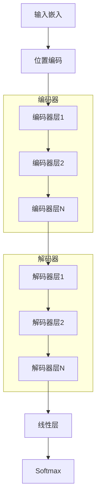
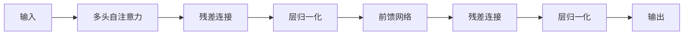
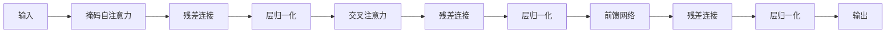

# Transformer架构深度解析

## 1. Transformer架构概览

### 1.1 架构的革命性突破

Transformer架构由Google于2017年提出，彻底改变了自然语言处理领域。其核心创新在于：

1. **完全基于注意力机制**：摒弃了循环和卷积结构
2. **并行计算**：所有位置可以并行处理
3. **长距离依赖**：直接建模任意距离的依赖关系
4. **可扩展性**：易于扩展到大规模模型

> **历史意义**：Transformer的出现标志着NLP从"统计时代"进入"深度学习时代"，为后来的GPT、BERT等大语言模型奠定了基础。

### 1.2 整体架构图

### 1.3 编码器-解码器 vs 仅编码器 vs 仅解码器

| 架构类型 | 代表模型 | 特点 | 适用场景 |
|---------|---------|------|----------|
| **编码器-解码器** | 原始Transformer、T5 | 双向编码 + 自回归解码 | 机器翻译、文本摘要 |
| **仅编码器** | BERT、RoBERTa | 双向注意力 | 理解任务（分类、NER） |
| **仅解码器** | GPT系列、LLaMA | 因果注意力 | 生成任务 |

## 2. 编码器层详解

### 2.1 编码器层的结构

每个编码器层包含两个子层：

1. **多头自注意力子层**（Multi-Head Self-Attention）
2. **前馈神经网络子层**（Feed-Forward Network）

每个子层都采用**残差连接**（Residual Connection）和**层归一化**（Layer Normalization）。

### 2.2 多头自注意力子层

编码器的自注意力是**双向的**，每个位置都能看到所有其他位置：

$$\text{Attention}(\mathbf{Q}, \mathbf{K}, \mathbf{V}) = \text{softmax}\left(\frac{\mathbf{Q}\mathbf{K}^T}{\sqrt{d_k}}\right)\mathbf{V}$$

其中 $\mathbf{Q} = \mathbf{K} = \mathbf{V} = \mathbf{X}\mathbf{W}$。

> **关键特性**：双向注意力让模型能够同时利用上下文信息，这对理解任务至关重要。

### 2.3 前馈神经网络子层

前馈网络是一个两层的全连接网络：

$$\text{FFN}(x) = \max(0, x\mathbf{W}_1 + \mathbf{b}_1)\mathbf{W}_2 + \mathbf{b}_2$$

其中：
- $\mathbf{W}_1 \in \mathbb{R}^{d_{\text{model}} \times d_{ff}}$
- $\mathbf{W}_2 \in \mathbb{R}^{d_{ff} \times d_{\text{model}}}$
- $d_{ff}$ 通常是 $d_{\text{model}}$ 的4倍

**作用**：
- 提供非线性变换能力
- 每个位置独立处理（不跨位置交互）
- 增强模型的表达能力

### 2.4 残差连接与层归一化

#### 2.4.1 残差连接

$$\text{Output} = \text{LayerNorm}(x + \text{Sublayer}(x))$$

**作用**：
- 缓解梯度消失问题
- 允许信息直接流动
- 便于训练深层网络

> **直观理解**：残差连接就像在高速公路上修建"快车道"，信息可以绕过复杂的处理直接传递。

#### 2.4.2 层归一化

层归一化对每个样本的所有特征进行归一化：

$$\text{LayerNorm}(x) = \frac{x - \mu}{\sigma} \odot \gamma + \beta$$

其中：
- $\mu = \frac{1}{d}\sum_{i=1}^{d} x_i$
- $\sigma = \sqrt{\frac{1}{d}\sum_{i=1}^{d}(x_i - \mu)^2}$
- $\gamma, \beta$ 是可学习的参数

**与批归一化的区别**：

| 特性 | 层归一化 | 批归一化 |
|------|----------|----------|
| 归一化维度 | 特征维度 | 批次维度 |
| 批次大小 | 不敏感 | 需要较大批次 |
| 训练/推理 | 一致 | 需要维护统计量 |

### 2.5 编码器层的完整计算流程

给定输入 $\mathbf{X} \in \mathbb{R}^{L \times d_{\text{model}}}$：

1. **多头自注意力**：
   $$\mathbf{A} = \text{MultiHeadAttention}(\mathbf{X}, \mathbf{X}, \mathbf{X})$$

2. **残差连接与层归一化**：
   $$\mathbf{X}_1 = \text{LayerNorm}(\mathbf{X} + \mathbf{A})$$

3. **前馈网络**：
   $$\mathbf{F} = \text{FFN}(\mathbf{X}_1)$$

4. **残差连接与层归一化**：
   $$\mathbf{X}_{\text{out}} = \text{LayerNorm}(\mathbf{X}_1 + \mathbf{F})$$

## 3. 解码器层详解

### 3.1 解码器层的结构

每个解码器层包含三个子层：

1. **掩码多头自注意力子层**（Masked Multi-Head Self-Attention）
2. **编码器-解码器注意力子层**（Encoder-Decoder Attention）
3. **前馈神经网络子层**（Feed-Forward Network）

### 3.2 掩码多头自注意力

解码器的自注意力使用**因果掩码**（Causal Mask），确保当前位置只能看到之前的位置：

$$M_{ij} = \begin{cases}
0 & \text{if } i \geq j \\
-\infty & \text{if } i < j
\end{cases}$$

$$\text{Attention}(\mathbf{Q}, \mathbf{K}, \mathbf{V}) = \text{softmax}\left(\frac{\mathbf{Q}\mathbf{K}^T}{\sqrt{d_k}} + \mathbf{M}\right)\mathbf{V}$$

> **为什么需要掩码？** 在生成任务中，模型不能"偷看"未来，否则训练和推理不一致。

### 3.3 编码器-解码器注意力

这个子层让解码器能够"关注"编码器的输出：

$$\mathbf{Q} = \mathbf{X}^{\text{decoder}}\mathbf{W}^Q$$
$$\mathbf{K} = \mathbf{X}^{\text{encoder}}\mathbf{W}^K$$
$$\mathbf{V} = \mathbf{X}^{\text{encoder}}\mathbf{W}^V$$

**作用**：
- 建立源序列和目标序列之间的对齐
- 允许解码器参考编码器的信息

> **例子**：在机器翻译中，解码器生成目标语言的词时，可以关注源语言中对应的词。

### 3.4 解码器层的完整计算流程

给定解码器输入 $\mathbf{X}^{\text{dec}}$ 和编码器输出 $\mathbf{X}^{\text{enc}}$：

1. **掩码自注意力**：
   $$\mathbf{A}_1 = \text{MaskedMultiHeadAttention}(\mathbf{X}^{\text{dec}}, \mathbf{X}^{\text{dec}}, \mathbf{X}^{\text{dec}})$$

2. **残差连接与层归一化**：
   $$\mathbf{X}_1 = \text{LayerNorm}(\mathbf{X}^{\text{dec}} + \mathbf{A}_1)$$

3. **编码器-解码器注意力**：
   $$\mathbf{A}_2 = \text{MultiHeadAttention}(\mathbf{X}_1, \mathbf{X}^{\text{enc}}, \mathbf{X}^{\text{enc}})$$

4. **残差连接与层归一化**：
   $$\mathbf{X}_2 = \text{LayerNorm}(\mathbf{X}_1 + \mathbf{A}_2)$$

5. **前馈网络**：
   $$\mathbf{F} = \text{FFN}(\mathbf{X}_2)$$

6. **残差连接与层归一化**：
   $$\mathbf{X}_{\text{out}} = \text{LayerNorm}(\mathbf{X}_2 + \mathbf{F})$$

## 4. 输入与输出处理

### 4.1 输入嵌入与位置编码

#### 4.1.1 词嵌入

$$\mathbf{E} \in \mathbb{R}^{|\mathcal{V}| \times d_{\text{model}}}$$

$$\mathbf{X}_{\text{emb}} = \mathbf{E}[\text{token\_indices}]$$

#### 4.1.2 位置编码

$$\mathbf{P} \in \mathbb{R}^{L_{\max} \times d_{\text{model}}}$$

$$\mathbf{X}_{\text{input}} = \mathbf{X}_{\text{emb}} + \mathbf{P}[0:L-1]$$

### 4.2 输出层

解码器的最终输出通过线性层和softmax：

$$\mathbf{O} = \mathbf{X}_{\text{final}} \mathbf{W}_{\text{out}}$$
$$P(x_t | x_{<t}) = \text{softmax}(\mathbf{O}_t)$$

其中 $\mathbf{W}_{\text{out}} \in \mathbb{R}^{d_{\text{model}} \times |\mathcal{V}|}$。

**权重共享**：许多模型将输出层的权重与输入嵌入共享，减少参数量。

## 5. Transformer的变体与优化

### 5.1 Pre-LN vs Post-LN

#### 5.1.1 Post-LN（原始Transformer）

层归一化在残差连接之后：

$$\text{Output} = \text{LayerNorm}(x + \text{Sublayer}(x))$$

**问题**：深层网络训练不稳定，梯度容易消失。

#### 5.1.2 Pre-LN（GPT-2、GPT-3）

层归一化在残差连接之前：

$$\text{Output} = x + \text{Sublayer}(\text{LayerNorm}(x))$$

**优势**：
- 训练更稳定
- 可以训练更深的网络
- 不需要学习率预热

### 5.2 激活函数的演进

| 激活函数 | 公式 | 特点 | 使用模型 |
|---------|------|------|----------|
| **ReLU** | $\max(0, x)$ | 简单、高效 | 原始Transformer |
| **GELU** | $x\Phi(x)$ | 更平滑 | BERT、GPT-2 |
| **SwiGLU** | $\text{Swish}(xW_1) \odot (xW_2)$ | 性能更好 | LLaMA、PaLM |

其中 $\Phi(x)$ 是标准正态分布的CDF。

### 5.3 归一化位置

除了Pre-LN，还有其他归一化策略：

- **RMSNorm**：去掉均值归一化，计算更高效
- **DeepNorm**：调整残差连接的权重，稳定深层网络
- **ScaleNorm**：按比例缩放而非完全归一化

### 5.4 注意力优化

#### 5.4.1 Flash Attention

通过IO感知的精确注意力算法，大幅提升效率：

- 分块计算，避免存储完整的注意力矩阵
- 重计算而非存储中间结果
- 融合内核，减少内存访问

#### 5.4.2 多查询注意力（Multi-Query Attention）

所有注意力头共享键和值：

$$\mathbf{K} = \mathbf{V} = \mathbf{X}\mathbf{W}^{KV}$$

**优势**：
- 减少内存占用
- 加速推理

**使用模型**：PaLM, LLaMA-2

#### 5.4.3 分组查询注意力（Grouped-Query Attention）

折中方案：多个头共享键和值：

$$\mathbf{K} = \mathbf{X}\mathbf{W}^{K}, \quad \mathbf{V} = \mathbf{X}\mathbf{W}^{V}$$

其中 $\mathbf{W}^{K}, \mathbf{W}^{V}$ 的维度减少。

**使用模型**：LLaMA-2, LLaMA-3

## 6. Transformer的数学分析

### 6.1 感受野

在Transformer中，每个位置都能看到所有其他位置，感受野为整个序列：

$$\text{ReceptiveField}(i) = \{0, 1, \ldots, L-1\}$$

这与RNN（感受野随层数线性增长）和CNN（感受野随层数指数增长）形成对比。

### 6.2 路径长度

任意两个位置之间的最短路径长度为1（直接注意力），而RNN需要O(n)步。

### 6.3 表达能力

研究表明，Transformer具有强大的表达能力：

1. **通用近似器**：可以近似任何连续函数
2. **图灵完备**：可以模拟图灵机
3. **归纳偏置**：注意力机制天然适合序列数据

## 7. 现代大语言模型的架构选择

### 7.1 GPT系列（仅解码器）

**架构特点**：
- 仅使用解码器
- 因果掩码自注意力
- Pre-LN归一化
- 位置编码：学习到的绝对位置编码（GPT-2/3）或旋转位置编码（GPT-4）

**适用场景**：
- 文本生成
- 对话系统
- 代码生成

### 7.2 BERT系列（仅编码器）

**架构特点**：
- 仅使用编码器
- 双向自注意力
- 掩码语言建模（MLM）预训练

**适用场景**：
- 文本分类
- 命名实体识别
- 问答系统

### 7.3 T5系列（编码器-解码器）

**架构特点**：
- 完整的编码器-解码器
- 文本到文本框架
- 前缀LM（Prefix LM）

**适用场景**：
- 机器翻译
- 文本摘要
- 复杂推理任务

### 7.4 LLaMA系列（仅解码器）

**架构特点**：
- 仅解码器
- Pre-LN + RMSNorm
- SwiGLU激活函数
- 旋转位置编码（RoPE）
- 分组查询注意力（GQA）

**创新点**：
- 更高效的架构设计
- 更好的训练稳定性
- 更强的推理能力

## 8. Transformer的扩展性

### 8.1 模型规模的扩展

| 模型 | 参数量 | 层数 | 头数 | $d_{\text{model}}$ |
|------|--------|------|------|-------------------|
| Transformer (base) | 65M | 6 | 8 | 512 |
| Transformer (big) | 213M | 6 | 16 | 1024 |
| GPT-3 (175B) | 175B | 96 | 96 | 12288 |
| LLaMA-2 (70B) | 70B | 80 | 64 | 8192 |

### 8.2 扩展法则

研究表明，模型性能遵循**扩展法则**（Scaling Laws）：

$$L(N, D) \approx \frac{A}{N^\alpha} + \frac{B}{D^\beta}$$

其中：
- $L$ 是损失
- $N$ 是参数量
- $D$ 是数据量
- $A, B, \alpha, \beta$ 是常数

**关键发现**：
1. 损失随参数量和数据量的增加而下降
2. 性能可以预测（幂律关系）
3. 三要素协同优化：参数量、数据量、计算量

### 8.3 计算复杂度

| 组件 | 复杂度 | 说明 |
|------|--------|------|
| 自注意力 | $O(L^2 \cdot d)$ | $L$ 是序列长度 |
| 前馈网络 | $O(L \cdot d^2)$ | $d$ 是模型维度 |
| 嵌入层 | $O(|\mathcal{V}| \cdot d)$ | $|\mathcal{V}|$ 是词汇表大小 |

**总复杂度**：$O(L^2 \cdot d + L \cdot d^2)$

## 9. Transformer的实践技巧

### 9.1 初始化策略

- **Xavier初始化**：保持方差稳定
- **He初始化**：适合ReLU激活函数
- **缩放初始化**：考虑残差连接

### 9.2 优化器选择

| 优化器 | 特点 | 使用模型 |
|--------|------|----------|
| **Adam** | 自适应学习率 | 原始Transformer、BERT |
| **AdamW** | 解耦权重衰减 | GPT-2、GPT-3 |
| **Sophia** | 二阶信息 | 最新的研究 |

### 9.3 学习率调度

- **学习率预热**（Warmup）：初始阶段线性增加学习率
- **余弦退火**（Cosine Decay）：训练后期平滑降低学习率
- **恒定学习率**：大模型训练时使用

### 9.4 正则化技术

- **Dropout**：随机丢弃神经元
- **DropPath**：随机丢弃整个路径
- **标签平滑**：软化标签分布
- **权重衰减**：L2正则化

## 10. 小结

Transformer架构是现代大语言模型的基石，其核心创新在于完全基于注意力机制，实现了高效的并行计算和强大的长距离依赖建模能力。

关键要点：
1. Transformer由编码器和解码器组成，各有不同的注意力模式
2. 编码器使用双向注意力，解码器使用因果注意力
3. 残差连接和层归一化是训练深层网络的关键
4. Pre-LN、SwiGLU、RoPE等优化提升了模型性能
5. 不同的架构选择适用于不同的任务场景
6. 模型规模遵循扩展法则，性能可预测
7. Flash Attention等优化技术大幅提升了计算效率

下一章，我们将探讨如何在大规模数据上预训练这些模型，让它们学习到丰富的语言知识。
