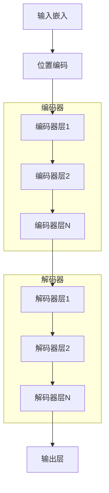
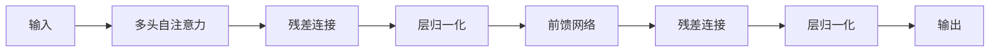
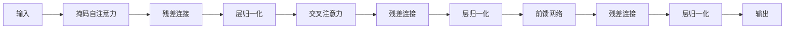

# Transformer架构深度解析

## Transformer：现代大语言模型的骨架

Transformer架构由Google于2017年提出，彻底改变了自然语言处理领域。它的核心创新在于：**完全基于注意力机制**，摒弃了传统的循环和卷积结构。

> **历史意义**：Transformer的出现标志着NLP从"统计时代"进入"深度学习时代"，为后来的GPT、BERT等大语言模型奠定了基础。

## Transformer的整体架构

### 编码器-解码器结构

原始Transformer包含两个部分：编码器（Encoder）和解码器（Decoder）。



> **直观理解**：编码器就像"理解者"，负责理解输入；解码器就像"表达者"，负责生成输出。在机器翻译中，编码器理解中文，解码器生成英文。

### 三种架构变体

| 架构类型 | 代表模型 | 特点 | 适用场景 |
|---------|---------|------|----------|
| **编码器-解码器** | 原始Transformer、T5 | 双向编码 + 自回归解码 | 机器翻译、文本摘要 |
| **仅编码器** | BERT、RoBERTa | 双向注意力 | 理解任务（分类、NER） |
| **仅解码器** | GPT系列、LLaMA | 因果注意力 | 生成任务 |

## 编码器层：理解的核心

### 编码器层的结构

每个编码器层包含两个子层：

1. **多头自注意力子层**（Multi-Head Self-Attention）
2. **前馈神经网络子层**（Feed-Forward Network）



### 多头自注意力子层

编码器的自注意力是**双向的**，每个位置都能看到所有其他位置。

> **直观理解**：就像你在读一句话，理解每个词时都可以参考句子中的所有其他词。理解"玩"，可以参考"今天"、"天气"、"想"等，无论它们在前面还是后面。

对于"今天天气真好，我想出去玩"：
- 理解"今天"时，可以看到"天气"、"真"、"好"、"，"、"我"、"想"、"出"、"去"、"玩"
- 理解"玩"时，可以看到"今天"、"天气"、"真"、"好"、"，"、"我"、"想"、"出"、"去"

> **为什么双向很重要？** 双向注意力让模型能够同时利用上下文信息，这对理解任务至关重要。比如理解"苹果"，如果前面有"吃"，可能是水果；如果前面有"公司"，可能是科技公司。

### 前馈神经网络子层

前馈网络是一个两层的全连接网络。

> **直观理解**：前馈网络就像一个"处理器"，对每个位置的信息进行独立的处理和转换。它不跨位置交互，而是增强每个位置的表示能力。

> **数学概念：非线性变换**：前馈网络包含激活函数（如ReLU、GELU），引入非线性。没有非线性，无论堆叠多少层，都等价于一层线性变换。非线性让模型能够学习复杂的函数。

### 残差连接与层归一化

每个子层都采用**残差连接**（Residual Connection）和**层归一化**（Layer Normalization）。

#### 残差连接

```
输出 = LayerNorm(输入 + 子层(输入))
```

> **直观理解**：残差连接就像在高速公路上修建"快车道"，信息可以绕过复杂的处理直接传递。这缓解了梯度消失问题，允许信息直接流动。

#### 层归一化

层归一化对每个样本的所有特征进行归一化。

> **直观理解**：层归一化就像给数据"标准化"，让每个特征的数值范围相近。这有助于训练稳定性，防止某些特征过大或过小。

> **与批归一化的区别**：批归一化按批次归一化，需要较大的批次；层归一化按特征归一化，不依赖批次大小。

## 解码器层：生成的核心

### 解码器层的结构

每个解码器层包含三个子层：

1. **掩码多头自注意力子层**（Masked Multi-Head Self-Attention）
2. **编码器-解码器注意力子层**（Encoder-Decoder Attention）
3. **前馈神经网络子层**（Feed-Forward Network）



### 掩码多头自注意力

解码器的自注意力使用**因果掩码**（Causal Mask），确保当前位置只能看到之前的位置。

> **直观理解**：就像你在考试，只能看到已经做过的题目，不能看后面的题目。在生成任务中，模型不能"偷看"未来，否则训练和推理不一致。

对于"今天天气真好，我想出去玩"：
- 理解"今天"时，只能看到"今天"
- 理解"天气"时，只能看到"今天"、"天气"
- 理解"玩"时，只能看到"今天"、"天气"、"真"、"好"、"，"、"我"、"想"、"出"、"去"

### 编码器-解码器注意力

这个子层让解码器能够"关注"编码器的输出。

> **直观理解**：就像你在做翻译，生成英文时需要参考中文原文。Q来自解码器（英文），K和V来自编码器（中文）。

**应用场景**：
- 机器翻译：源语言和目标语言之间的对齐
- 文本摘要：原文和摘要之间的关联
- 问答：问题和文档之间的关联

## 现代大语言模型的架构选择

### GPT系列（仅解码器）

**架构特点**：
- 仅使用解码器
- 因果掩码自注意力
- 适合生成任务

**适用场景**：
- 文本生成
- 对话系统
- 代码生成

> **为什么GPT选择仅解码器？** 因为GPT的目标是生成文本，因果注意力正好符合"预测下一个词"的需求。

### BERT系列（仅编码器）

**架构特点**：
- 仅使用编码器
- 双向自注意力
- 适合理解任务

**适用场景**：
- 文本分类
- 命名实体识别
- 问答系统

> **为什么BERT选择仅编码器？** 因为BERT的目标是理解文本，双向注意力能够充分利用上下文信息。

### T5系列（编码器-解码器）

**架构特点**：
- 完整的编码器-解码器
- 文本到文本框架
- 适合复杂的理解+生成任务

**适用场景**：
- 机器翻译
- 文本摘要
- 复杂推理任务

## Transformer的优化技术

### Pre-LN vs Post-LN

#### Post-LN（原始Transformer）

层归一化在残差连接之后。

**问题**：深层网络训练不稳定，梯度容易消失。

#### Pre-LN（GPT-2、GPT-3）

层归一化在残差连接之前。

**优势**：
- 训练更稳定
- 可以训练更深的网络
- 不需要学习率预热

> **直观理解**：Pre-LN就像在处理前先"标准化"数据，让后续处理更稳定；Post-LN就像处理后再"标准化"，可能已经"太晚了"。

### 激活函数的演进

| 激活函数 | 特点 | 使用模型 |
|---------|------|----------|
| **ReLU** | 简单、高效 | 原始Transformer |
| **GELU** | 更平滑 | BERT、GPT-2 |
| **SwiGLU** | 性能更好 | LLaMA、PaLM |

> **直观理解**：激活函数就像"开关"，决定信息是否通过。ReLU是硬开关（要么全开要么全关），GELU是软开关（可以半开），SwiGLU是更复杂的开关（可以组合多个开关）。

### 位置编码的演进

| 方法 | 特点 | 使用模型 |
|------|------|----------|
| **正弦位置编码** | 固定、可外推 | 原始Transformer |
| **可学习位置编码** | 灵活、难外推 | GPT-2 |
| **旋转位置编码（RoPE）** | 相对位置、可外推 | LLaMA、GPT-4 |

> **直观理解**：位置编码就像给每个位置一个"身份证"。正弦编码是固定的身份证号，可学习编码是动态分配的身份证号，旋转编码是相对位置的身份证号（比如"前面第3个"）。

## Transformer的扩展性

### 模型规模的扩展

| 模型 | 参数量 | 层数 | 头数 | 维度 |
|------|--------|------|------|------|
| Transformer (base) | 65M | 6 | 8 | 512 |
| Transformer (big) | 213M | 6 | 16 | 1024 |
| GPT-3 (175B) | 175B | 96 | 96 | 12288 |
| LLaMA-2 (70B) | 70B | 80 | 64 | 8192 |

### 扩展法则

研究表明，模型性能遵循**扩展法则**（Scaling Laws）。

> **直观理解**：就像投资，投入越多（参数量、数据量、计算量），回报越大（性能越好）。而且这种关系是可以预测的，不是随机的。

**关键发现**：
1. 损失随参数量和数据量的增加而下降
2. 性能可以预测（幂律关系）
3. 三要素协同优化：参数量、数据量、计算量

## 小结

Transformer架构是现代大语言模型的基石。关键要点：

1. **编码器-解码器**：原始架构，编码器理解，解码器生成
2. **仅编码器**：双向注意力，适合理解任务（BERT）
3. **仅解码器**：因果注意力，适合生成任务（GPT）
4. **残差连接**：信息快车道，缓解梯度消失
5. **层归一化**：数据标准化，提升训练稳定性
6. **Pre-LN**：归一化在前，训练更稳定
7. **扩展法则**：投入越多，性能越好，且可预测

> **数学概念回顾**：
> - **非线性变换**：激活函数引入非线性，让模型能学习复杂函数
> - **残差连接**：信息直接传递，缓解梯度消失
> - **归一化**：数据标准化，提升训练稳定性

现在，我们理解了Transformer如何把注意力机制组织成完整的架构。下一章，我们将探讨如何在大规模数据上训练这些模型——大规模预训练。
